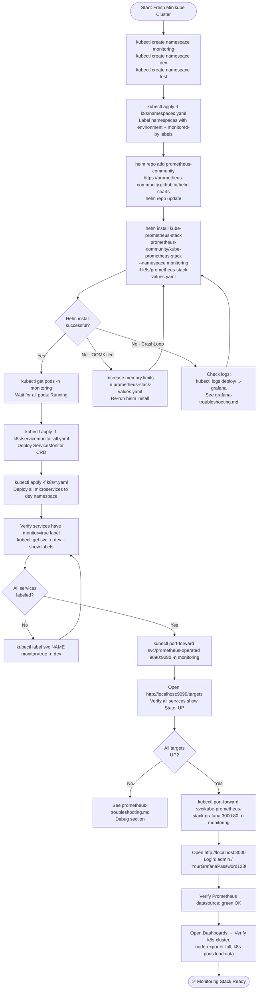
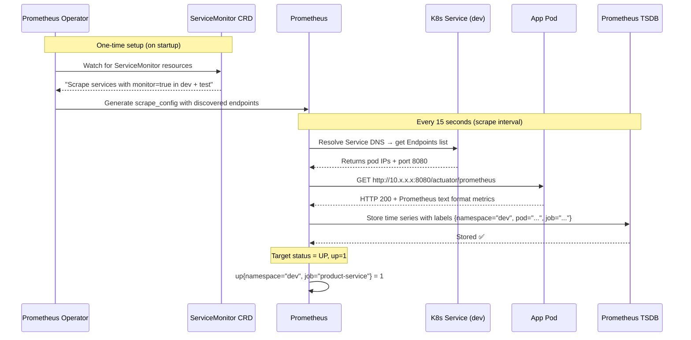
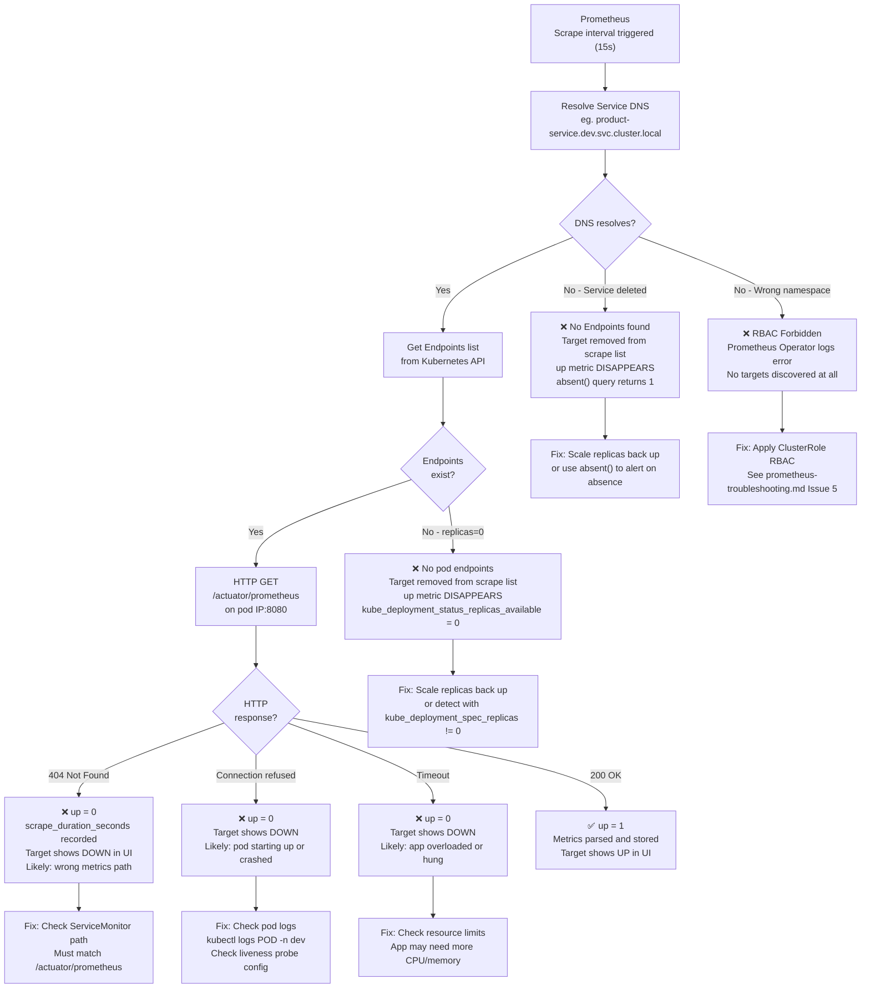
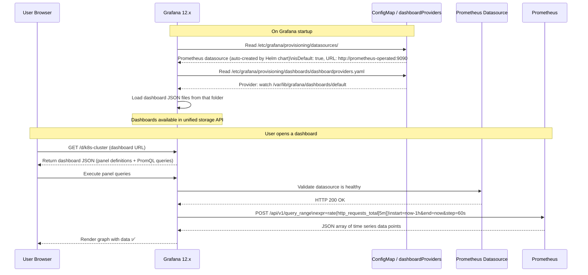
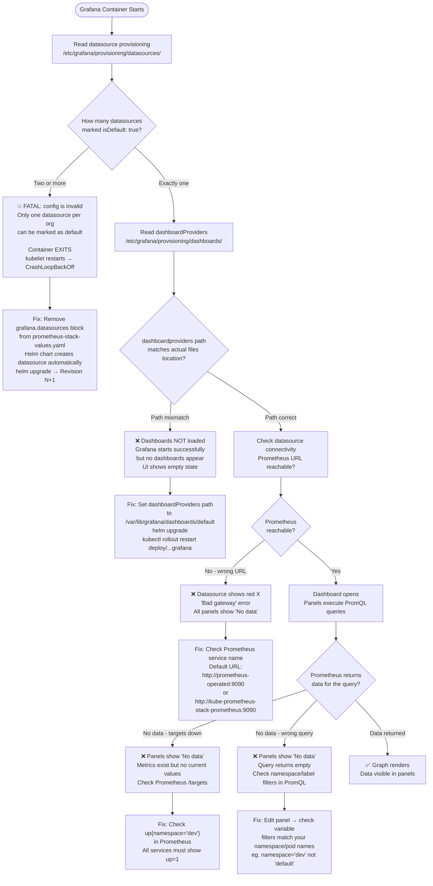
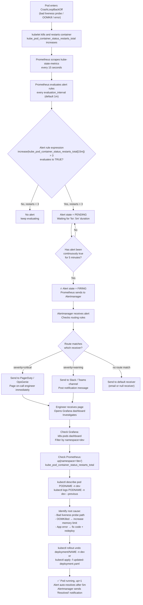
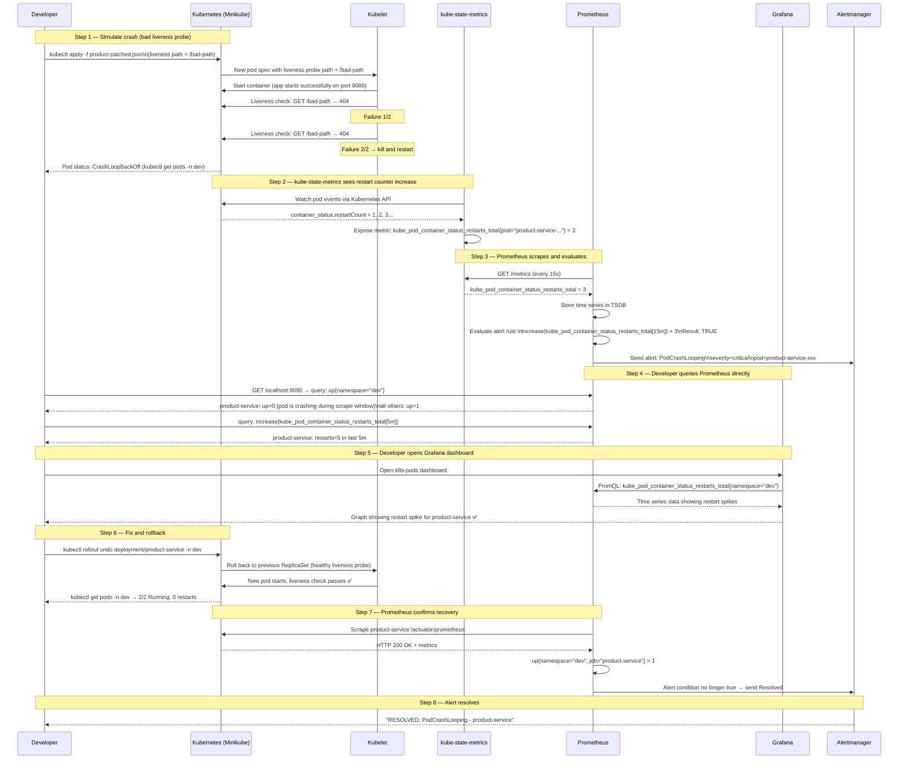

# Monitoring Flow Diagrams

Visual guide to how the full monitoring stack works in this project — from deployment to alert firing — and what happens when each part succeeds or fails.

> All diagrams use Mermaid syntax. They render automatically on GitHub, VS Code (with Markdown Preview), and most modern documentation platforms.

---

## Table of Contents

1. [Overall Architecture](#1-overall-architecture)
2. [Setup and Deployment Flow](#2-setup-and-deployment-flow)
3. [Prometheus Scraping Flow — Success Path](#3-prometheus-scraping-flow--success-path)
4. [Prometheus Scraping Flow — Failure Paths](#4-prometheus-scraping-flow--failure-paths)
5. [Grafana Dashboard Flow — Success Path](#5-grafana-dashboard-flow--success-path)
6. [Grafana Dashboard Flow — Failure Paths](#6-grafana-dashboard-flow--failure-paths)
7. [Alert Firing Flow](#7-alert-firing-flow)
8. [Debug Decision Tree — "My Metrics Are Missing"](#8-debug-decision-tree--my-metrics-are-missing)
9. [Debug Decision Tree — "Grafana Is Broken"](#9-debug-decision-tree--grafana-is-broken)
10. [Full End-to-End Flow — Pod Crash Scenario](#10-full-end-to-end-flow--pod-crash-scenario)
11. [Interview Diagrams](#interview-diagrams) ← simplified diagrams + what to say

---

## 1. Overall Architecture

This shows every component in the monitoring stack and how they connect.

```mermaid
graph TB
    subgraph cluster["Minikube Cluster"]

        subgraph monitoring["namespace: monitoring"]
            HelmChart["kube-prometheus-stack\nHelm Chart v83.6.0"]
            Prom["Prometheus\nport 9090\nScrapes every 15s"]
            Graf["Grafana 12.4.3\nport 3000\nDashboards + Alerts"]
            AM["Alertmanager\nport 9093\nRoutes alerts"]
            KSM["kube-state-metrics\nCluster-level metrics"]
            NE["node-exporter\nNode-level metrics"]
            PromOp["Prometheus Operator\nWatches ServiceMonitor CRDs"]
            SM["ServiceMonitor CRD\necommerce-all-services\nWatches dev + test"]
        end

        subgraph dev["namespace: dev"]
            PS["product-service\n:8080/actuator/prometheus"]
            OS["order-service\n:8080/actuator/prometheus"]
            US["user-service\n:8080/actuator/prometheus"]
            AS["auth-service\n:8080/actuator/prometheus"]
            IS["inventory-service\n:8080/actuator/prometheus"]
            PAY["payment-service\n:8080/actuator/prometheus"]
            NOT["notification-service\n:8080/actuator/prometheus"]
            AG["api-gateway\n:8080/actuator/prometheus"]
        end

        subgraph test["namespace: test"]
            TestSvcs["same services\ntest builds"]
        end

    end

    subgraph local["Local Machine"]
        PF1["port-forward\nlocalhost:9090"]
        PF2["port-forward\nlocalhost:3000"]
        Browser["Browser\nPrometheus UI\nGrafana UI"]
    end

    HelmChart -->|deploys and manages| Prom
    HelmChart -->|deploys and manages| Graf
    HelmChart -->|deploys and manages| AM
    HelmChart -->|deploys and manages| KSM
    HelmChart -->|deploys and manages| NE
    HelmChart -->|deploys and manages| PromOp

    PromOp -->|reads CRD, generates scrape config| SM
    SM -->|targets services with monitor=true label| PS
    SM -->|targets services with monitor=true label| OS
    SM -->|targets services with monitor=true label| US
    SM -->|targets services with monitor=true label| AS

    Prom -->|scrapes /actuator/prometheus every 15s| PS
    Prom -->|scrapes /actuator/prometheus every 15s| OS
    Prom -->|scrapes /actuator/prometheus every 15s| US
    Prom -->|scrapes /actuator/prometheus every 15s| AS
    Prom -->|scrapes /actuator/prometheus every 15s| IS
    Prom -->|scrapes /actuator/prometheus every 15s| PAY
    Prom -->|scrapes /actuator/prometheus every 15s| NOT
    Prom -->|scrapes /actuator/prometheus every 15s| AG
    Prom -->|scrapes node metrics| NE
    Prom -->|scrapes cluster state| KSM
    Prom -->|fires alerts| AM

    Graf -->|queries PromQL| Prom
    Graf -->|receives alerts from| AM

    PF1 -->|tunnels to| Prom
    PF2 -->|tunnels to| Graf
    Browser --> PF1
    Browser --> PF2
```



---

## 2. Setup and Deployment Flow

How the entire monitoring stack gets deployed from scratch.



---

## 3. Prometheus Scraping Flow — Success Path

What happens every 15 seconds when a scrape succeeds.



---

## 4. Prometheus Scraping Flow — Failure Paths

What Prometheus sees and records when something goes wrong.



---

## 5. Grafana Dashboard Flow — Success Path

How a Grafana dashboard loads data from Prometheus correctly.



---

## 6. Grafana Dashboard Flow — Failure Paths

What breaks and why for each common Grafana failure.



---

## 7. Alert Firing Flow

How a problem in a microservice eventually becomes a firing alert.



---

## 8. Debug Decision Tree — "My Metrics Are Missing"

Use this when a service is not showing up in Prometheus at all, or showing `up=0`.


---

## 9. Debug Decision Tree — "Grafana Is Broken"

Use this when Grafana is crashing, not showing dashboards, or showing "No data".


---

## 10. Full End-to-End Flow — Pod Crash Scenario

This is the complete story of what happened in this project: product-service was made to crash-loop, and we validated the full monitoring chain.



---

## ASCII Summary Diagram

For environments where Mermaid does not render (plain text terminals, some editors):

```
MONITORING STACK — OVERALL DATA FLOW
=====================================

  [Minikube Cluster]
  ┌─────────────────────────────────────────────────────────────┐
  │                                                             │
  │  namespace: dev / test                                      │
  │  ┌──────────────┐  ┌──────────────┐  ┌──────────────┐      │
  │  │product-service│  │ order-service│  │  user-service│ ...  │
  │  │:8080/actuator │  │:8080/actuator│  │:8080/actuator│      │
  │  │  /prometheus  │  │  /prometheus │  │  /prometheus │      │
  │  └──────┬───────┘  └──────┬───────┘  └──────┬───────┘      │
  │         │                 │                  │               │
  │         └─────────────────┴──────────────────┘               │
  │                           │ scrape every 15s                  │
  │                           ▼                                   │
  │  namespace: monitoring                                        │
  │  ┌─────────────────────────────────────────────┐             │
  │  │              kube-prometheus-stack           │             │
  │  │                                             │             │
  │  │  Prometheus Operator                        │             │
  │  │       │ reads ServiceMonitor CRD            │             │
  │  │       ▼                                     │             │
  │  │  Prometheus ──────────────────────────────► │             │
  │  │  (stores TSDB)       alerts                 │             │
  │  │       │                   │                 │             │
  │  │       │               Alertmanager          │             │
  │  │       │               (routes alerts)       │             │
  │  │       │                                     │             │
  │  │       ▼                                     │             │
  │  │   Grafana                                   │             │
  │  │  (PromQL queries → dashboards)              │             │
  │  └─────────────────────────────────────────────┘             │
  │                                                             │
  └─────────────────────────────────────────────────────────────┘
                    │                    │
           port-forward              port-forward
           localhost:9090            localhost:3000
                    │                    │
              Prometheus UI          Grafana UI
              /targets               /d/dashboards
              /graph                 Login: admin


WHAT HAPPENS WHEN THINGS BREAK
================================

  Pod crash-loops       →  up=0 in Prometheus
                        →  restart counter rises in kube-state-metrics
                        →  Alert fires after threshold met
                        →  Grafana dashboard shows spike

  Pod scaled to zero    →  Target disappears (NOT up=0, just absent)
                        →  absent() PromQL returns 1
                        →  No alert unless you use absent() rule

  Wrong Service label   →  Service not discovered by ServiceMonitor
                        →  Target never appears in /targets
                        →  No data at all

  Grafana crash         →  Usually: duplicate default datasource
                        →  Fix: remove grafana.datasources from values
                        →  helm upgrade → pod restarts healthy

  Dashboards missing    →  Usually: dashboardProviders path mismatch
                        →  Fix: add dashboardProviders with correct path
                        →  helm upgrade → dashboards load
```

---

## Interview Diagrams

> Use these diagrams when explaining the monitoring stack in an interview.
> Each one is small enough to draw on a whiteboard in under 2 minutes and covers exactly what an interviewer expects to hear.

---

### Interview Diagram 1 — "How does Prometheus collect metrics?"

**What the interviewer is asking:** Explain the scraping model. How does Prometheus know where to look?

```
  ┌─────────────────────────────────────────────────────┐
  │  How Prometheus discovers and scrapes targets        │
  └─────────────────────────────────────────────────────┘

   You deploy this:              Prometheus reads this:

   Service (K8s object)          ServiceMonitor (CRD)
   ┌──────────────────┐          ┌──────────────────────┐
   │ name: product-svc│◄─────────│ selector:            │
   │ label:           │  matches │   monitor: "true"    │
   │   monitor: "true"│          │ namespaces: [dev,test]│
   │ port: 8080       │          │ path: /actuator/     │
   └────────┬─────────┘          │         prometheus   │
            │                    └──────────────────────┘
            │ pod IP                        │
            ▼                    Prometheus Operator reads
   ┌──────────────────┐          the CRD and writes scrape
   │   App Pod        │          config into Prometheus
   │ :8080/actuator/  │◄──────────────────────────────────
   │   prometheus     │
   │                  │   Every 15s: GET /actuator/prometheus
   └──────────────────┘   Response: up=1 (success) or up=0 (fail)
```

**Say in the interview:**
> "Prometheus uses a pull model. It does not receive data — it goes out and asks each app for metrics every 15 seconds. In Kubernetes, we use a ServiceMonitor CRD to tell Prometheus which services to scrape. The Prometheus Operator watches for ServiceMonitor objects and automatically generates the scrape configuration. Services must have the `monitor: true` label to be discovered."

---

### Interview Diagram 2 — "How does Grafana connect to Prometheus?"

**What the interviewer is asking:** Explain the datasource + query model.

```
  ┌──────────────────────────────────────────────────────────┐
  │  Grafana → Prometheus data flow                           │
  └──────────────────────────────────────────────────────────┘

  User opens dashboard
         │
         ▼
     Grafana
  ┌──────────────┐
  │  Dashboard   │  contains panels, each panel has a PromQL query
  │              │
  │  Panel 1:    │──── PromQL: rate(http_requests_total[5m])
  │  Panel 2:    │──── PromQL: up{namespace="dev"}
  │  Panel 3:    │──── PromQL: kube_pod_container_status_restarts_total
  └──────┬───────┘
         │  HTTP POST /api/v1/query_range
         ▼
     Prometheus
  ┌──────────────┐
  │  TSDB        │  Time Series Database (stores all scraped metrics)
  │  (on disk)   │──── returns JSON array of data points
  └──────────────┘
         │
         ▼
  Grafana renders graph ✅
```

**Say in the interview:**
> "Grafana does not store any metrics. It is purely a visualization layer. Each dashboard panel contains a PromQL query. When you open a dashboard, Grafana sends those queries to Prometheus over HTTP, Prometheus runs them against its time series database and returns the results, and Grafana renders the graph. If there is no data, the problem is either in Prometheus (targets are down) or the PromQL query itself (wrong label filters)."

---

### Interview Diagram 3 — "Walk me through what happens when a pod crashes"

**What the interviewer is asking:** End-to-end incident flow. This is the most common interview question.

```
  ┌────────────────────────────────────────────────────────────────┐
  │  Pod crash → Alert → Engineer notified (end-to-end)            │
  └────────────────────────────────────────────────────────────────┘

  1. Pod crashes
     App pod ──► liveness probe fails ──► kubelet kills container
                                      ──► restarts it
                                      ──► CrashLoopBackOff

  2. kube-state-metrics sees it
     Kubernetes API ──► kube-state-metrics
     kube_pod_container_status_restarts_total{pod="product-..."} = 5

  3. Prometheus scrapes and evaluates
     Prometheus scrapes kube-state-metrics every 15s
     Evaluates alert rule:
       increase(restarts_total[15m]) > 3  →  TRUE
     Alert state: PENDING → (after 5 min) → FIRING

  4. Alertmanager routes the alert
     Prometheus ──► Alertmanager
                        │
                        ├── severity=critical ──► PagerDuty (page engineer)
                        └── severity=warning  ──► Slack (post message)

  5. Engineer investigates
     Grafana dashboard ──► see restart spike on k8s-pods dashboard
     Prometheus query  ──► up{namespace="dev"} shows up=0
     kubectl logs      ──► read the actual error message
     kubectl describe  ──► see liveness probe failure events

  6. Fix and verify
     kubectl rollout undo deployment/product-service -n dev
     up{namespace="dev"} returns 1 ──► alert auto-resolves
     Alertmanager sends "RESOLVED" notification
```

**Say in the interview:**
> "When a pod crashes, kubelet restarts it. kube-state-metrics tracks the restart count via the Kubernetes API. Prometheus scrapes kube-state-metrics every 15 seconds and evaluates alert rules against that data. When the restart count exceeds the threshold for the required duration, Prometheus fires the alert to Alertmanager. Alertmanager routes it — critical alerts go to PagerDuty, warnings go to Slack. The engineer then uses Grafana to see the dashboard spike and Prometheus to run queries. After the fix, Prometheus sees `up=1` again, the alert condition is no longer true, and Alertmanager sends a resolved notification."

---

### Interview Diagram 4 — "What did you debug in this project?"

**What the interviewer is asking:** Tell me about a real problem you solved. This is your answer.

```
  ┌────────────────────────────────────────────────────────────────┐
  │  Real problems solved in this project                          │
  └────────────────────────────────────────────────────────────────┘

  Problem 1: Grafana CrashLoopBackOff
  ─────────────────────────────────────
  Root cause:  Two datasources both marked isDefault: true
               (one from Helm auto-config + one I added manually)

  How I found it:
    kubectl logs deploy/...-grafana -c grafana --previous
    → "datasource config is invalid. Only one datasource per
       organization can be marked as default"

  Fix:
    Removed manual grafana.datasources block from values.yaml
    → Helm chart manages datasource automatically
    → helm upgrade → pod restarted healthy → 3/3 Running

  ─────────────────────────────────────
  Problem 2: Dashboards not showing after upgrade
  ─────────────────────────────────────
  Root cause:  dashboardProviders path was /tmp/dashboards (wrong)
               Dashboard JSON files were at /var/lib/grafana/dashboards/default

  How I found it:
    kubectl exec into Grafana pod
    → ls /var/lib/grafana/dashboards/default/ showed .json files exist
    → But provisioning config was watching wrong directory

  Fix:
    Added dashboardProviders block with correct path in values.yaml
    → helm upgrade → Grafana reloaded dashboards ✅

  ─────────────────────────────────────
  Problem 3: Tested monitoring by simulating a crash
  ─────────────────────────────────────
  What I did:
    Injected bad liveness probe path (/bad-path) into product-service
    → Pod entered CrashLoopBackOff
    → Verified up=0 in Prometheus
    → Verified restart counter rising in kube-state-metrics
    → Saw spike in Grafana k8s-pods dashboard
    → Rolled back with kubectl rollout undo
    → Confirmed up=1 restored
```

**Say in the interview:**
> "I hit two real issues. First, Grafana was in CrashLoopBackOff. I read the pod logs and found the error said 'only one datasource can be marked as default' — I had accidentally added a duplicate by manually defining the Prometheus datasource in the Helm values file, which the chart already creates automatically. Removing the manual block and running helm upgrade fixed it. Second, dashboards were not showing. I exec'd into the Grafana pod, confirmed the JSON files existed in the right folder, but found the provisioning config was pointing to the wrong path. I added the correct dashboardProviders path and upgraded again. I also validated the full monitoring chain by deliberately crashing a pod with a bad liveness probe, watching the restart counter rise in Prometheus, and confirming the alert would fire."

---

### Interview Diagram 5 — "What is the difference between Prometheus and Grafana?"

**What the interviewer is asking:** Can you explain their distinct roles clearly?

```
  ┌─────────────────────┬──────────────────────────────────────────┐
  │   Prometheus        │   Grafana                                │
  ├─────────────────────┼──────────────────────────────────────────┤
  │ Collects metrics    │ Displays metrics                         │
  │ Stores time series  │ Does NOT store anything                  │
  │ Evaluates alerts    │ Visualizes — graphs, tables, gauges       │
  │ Pushes to           │ Queries Prometheus using PromQL          │
  │   Alertmanager      │ Can show data from many datasources      │
  │ Pull-based model    │ UI layer only                            │
  │ (goes to the app)   │ (reads from backends)                    │
  │                     │                                          │
  │ You can use it      │ You NEED a backend like Prometheus       │
  │ without Grafana     │ to show any data                         │
  └─────────────────────┴──────────────────────────────────────────┘

  Think of it like:
  Prometheus = database that collects and stores sensor readings
  Grafana    = dashboard screen that displays those readings
```

**Say in the interview:**
> "Prometheus is the metrics database. It scrapes metrics from your apps on a schedule, stores them as time series data, and evaluates alert rules. Grafana is a visualization tool — it has no storage of its own. It queries Prometheus using PromQL and renders the results as graphs and dashboards. You could use Prometheus without Grafana by running queries in the Prometheus UI, but Grafana gives you much better visualizations and alerting UI. Grafana can also connect to other datasources like Elasticsearch or Loki, so in production teams often use one Grafana instance to visualize data from multiple backends."

---

### Quick Interview Cheat Sheet

> Read this the night before the interview.

```
KEY NUMBERS TO REMEMBER
  Scrape interval:    15 seconds (how often Prometheus polls apps)
  Evaluation interval: 1 minute  (how often alert rules are checked)
  Alert "for" duration: 5 minutes (how long condition must be true before firing)
  Helm chart:         kube-prometheus-stack (bundles everything)
  Helm revision:      3 (upgraded twice to fix issues)
  Grafana version:    12.4.3
  Namespace:          monitoring (all stack components)
                      dev / test (all application workloads)

KEY COMMANDS
  Check all monitoring pods:  kubectl get pods -n monitoring
  Check app pods:             kubectl get pods -n dev
  Access Prometheus:          kubectl port-forward svc/prometheus-operated 9090:9090 -n monitoring
  Access Grafana:             kubectl port-forward svc/kube-prometheus-stack-grafana 3000:80 -n monitoring
  Upgrade stack:              helm upgrade kube-prometheus-stack ... -f prometheus-stack-values.yaml
  Check Grafana logs:         kubectl logs deploy/kube-prometheus-stack-grafana -c grafana -n monitoring
  Rollback a deploy:          kubectl rollout undo deployment/NAME -n dev

KEY CONCEPTS
  ServiceMonitor:   CRD that tells Prometheus which services to scrape
                    Must be in "monitoring" namespace
                    Service must have "monitor: true" label
  kube-state-metrics: Exposes cluster state as metrics (pod counts, restart counts, etc.)
  node-exporter:    Exposes node-level metrics (CPU, memory, disk of the VM/node)
  Alertmanager:     Receives alerts from Prometheus, routes to Slack/PagerDuty/email
  TSDB:             Time Series Database — how Prometheus stores metric data on disk
  PromQL:           Query language for Prometheus
                    rate() for counters, avg_over_time() for gauges, absent() for missing

INTERVIEW ANSWER STRUCTURE (use for any monitoring question)
  1. What the tool does (one sentence)
  2. How it connects to the other tools (data flow)
  3. What you configured in this project
  4. A real problem you hit and how you fixed it
```

---

## Related Guides

- [grafana-troubleshooting.md](grafana-troubleshooting.md) — All Grafana issues and fixes
- [prometheus-troubleshooting.md](prometheus-troubleshooting.md) — All Prometheus issues and fixes
- [cross-namespace-networking.md](cross-namespace-networking.md) — How networking works between namespaces
- [prometheus-beginner-to-practitioner.md](prometheus-beginner-to-practitioner.md) — Learning guide for Prometheus
- [grafana-beginner-to-practitioner.md](grafana-beginner-to-practitioner.md) — Learning guide for Grafana
