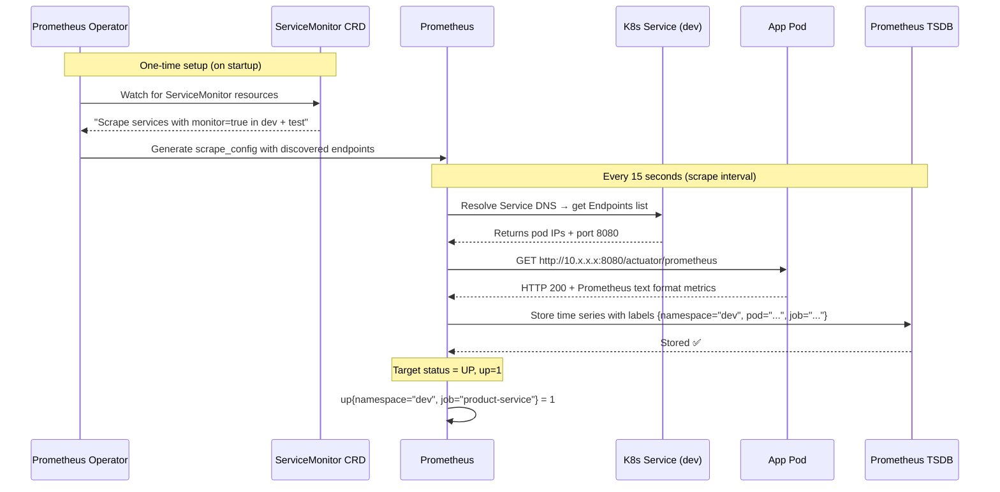
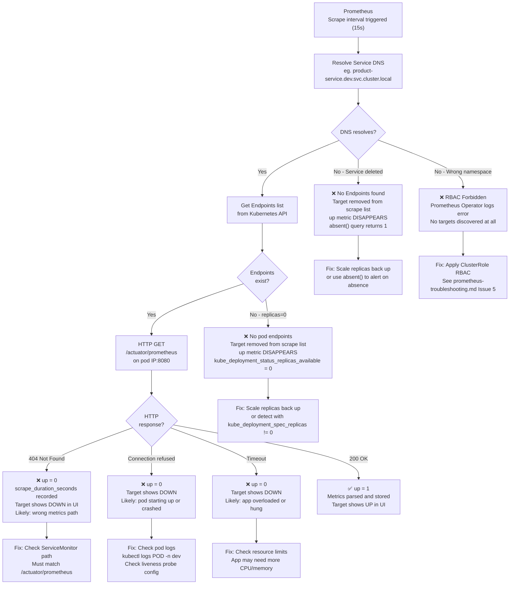
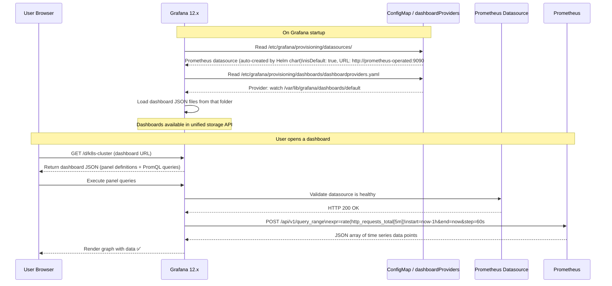
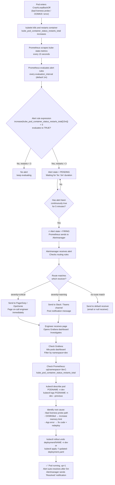
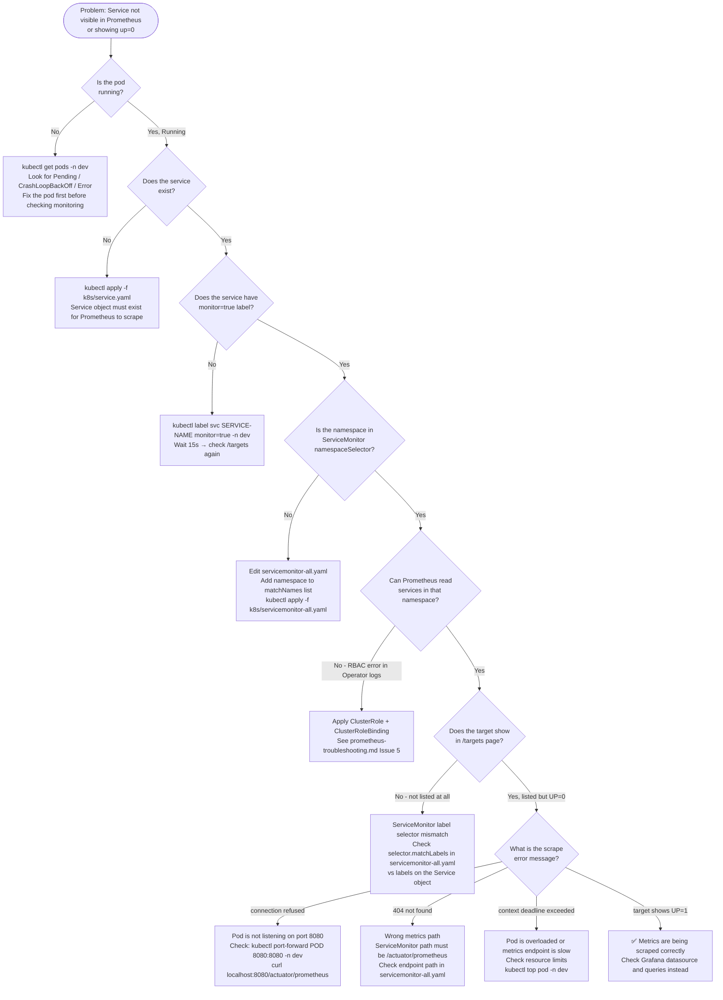
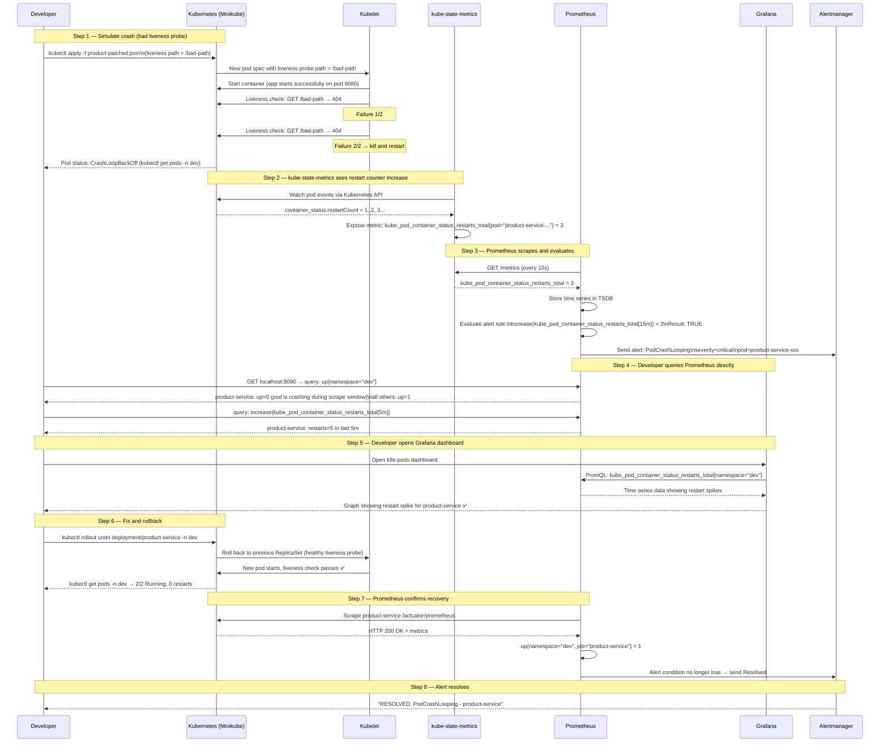

# Monitoring Flow Diagrams

Visual guide to how the full monitoring stack works in this project — from deployment to alert firing — and what happens when each part succeeds or fails.

> All diagrams use Mermaid syntax. They render automatically on GitHub, VS Code (with Markdown Preview), and most modern documentation platforms.

---

## Table of Contents

1. [Overall Architecture](#1-overall-architecture)
2. [Setup and Deployment Flow](#2-setup-and-deployment-flow)
3. [Prometheus Scraping Flow — Success Path](#3-prometheus-scraping-flow--success-path)
4. [Prometheus Scraping Flow — Failure Paths](#4-prometheus-scraping-flow--failure-paths)
5. [Grafana Dashboard Flow — Success Path](#5-grafana-dashboard-flow--success-path)
6. [Grafana Dashboard Flow — Failure Paths](#6-grafana-dashboard-flow--failure-paths)
7. [Alert Firing Flow](#7-alert-firing-flow)
8. [Debug Decision Tree — "My Metrics Are Missing"](#8-debug-decision-tree--my-metrics-are-missing)
9. [Debug Decision Tree — "Grafana Is Broken"](#9-debug-decision-tree--grafana-is-broken)
10. [Full End-to-End Flow — Pod Crash Scenario](#10-full-end-to-end-flow--pod-crash-scenario)
11. [Interview Diagrams](#interview-diagrams) ← simplified diagrams + what to say
    - [Diagram 1 — How Prometheus collects metrics](#interview-diagram-1--how-does-prometheus-collect-metrics)
    - [Diagram 2 — How Grafana connects to Prometheus](#interview-diagram-2--how-does-grafana-connect-to-prometheus)
    - [Diagram 3 — Pod crash end-to-end flow](#interview-diagram-3--walk-me-through-what-happens-when-a-pod-crashes)
    - [Diagram 4 — Real problems we debugged](#interview-diagram-4--what-did-you-debug-in-this-project)
    - [Diagram 5 — Prometheus vs Grafana difference](#interview-diagram-5--what-is-the-difference-between-prometheus-and-grafana)
    - [Diagram 6 — 4 Prometheus metric types](#interview-diagram-6--what-are-the-4-prometheus-metric-types)
    - [Diagram 7 — Push vs Pull model](#interview-diagram-7--why-does-prometheus-pull-metrics-instead-of-apps-pushing-them)
    - [Diagram 8 — Prometheus Operator explained](#interview-diagram-8--what-is-the-prometheus-operator-and-why-do-we-need-it)
    - [Diagram 9 — Alertmanager: grouping, silencing, inhibition](#interview-diagram-9--how-does-alertmanager-prevent-alert-storms)
    - [Diagram 10 — PromQL 6 key patterns](#interview-diagram-10--what-is-promql-and-show-me-some-queries)
    - [Diagram 11 — Full component map of kube-prometheus-stack](#interview-diagram-11--explain-the-full-component-map-of-kube-prometheus-stack)
    - [Diagram 12 — Tricky interview questions with answers](#interview-diagram-12--tricky-questions-and-short-answers)
    - [Quick Interview Cheat Sheet](#quick-interview-cheat-sheet)

---

## 1. Overall Architecture

This shows every component in the monitoring stack and how they connect.

```mermaid
graph TB
    subgraph cluster["Minikube Cluster"]

        subgraph monitoring["namespace: monitoring"]
            HelmChart["kube-prometheus-stack\nHelm Chart v83.6.0"]
            Prom["Prometheus\nport 9090\nScrapes every 15s"]
            Graf["Grafana 12.4.3\nport 3000\nDashboards + Alerts"]
            AM["Alertmanager\nport 9093\nRoutes alerts"]
            KSM["kube-state-metrics\nCluster-level metrics"]
            NE["node-exporter\nNode-level metrics"]
            PromOp["Prometheus Operator\nWatches ServiceMonitor CRDs"]
            SM["ServiceMonitor CRD\necommerce-all-services\nWatches dev + test"]
        end

        subgraph dev["namespace: dev"]
            PS["product-service\n:8080/actuator/prometheus"]
            OS["order-service\n:8080/actuator/prometheus"]
            US["user-service\n:8080/actuator/prometheus"]
            AS["auth-service\n:8080/actuator/prometheus"]
            IS["inventory-service\n:8080/actuator/prometheus"]
            PAY["payment-service\n:8080/actuator/prometheus"]
            NOT["notification-service\n:8080/actuator/prometheus"]
            AG["api-gateway\n:8080/actuator/prometheus"]
        end

        subgraph test["namespace: test"]
            TestSvcs["same services\ntest builds"]
        end

    end

    subgraph local["Local Machine"]
        PF1["port-forward\nlocalhost:9090"]
        PF2["port-forward\nlocalhost:3000"]
        Browser["Browser\nPrometheus UI\nGrafana UI"]
    end

    HelmChart -->|deploys and manages| Prom
    HelmChart -->|deploys and manages| Graf
    HelmChart -->|deploys and manages| AM
    HelmChart -->|deploys and manages| KSM
    HelmChart -->|deploys and manages| NE
    HelmChart -->|deploys and manages| PromOp

    PromOp -->|reads CRD, generates scrape config| SM
    SM -->|targets services with monitor=true label| PS
    SM -->|targets services with monitor=true label| OS
    SM -->|targets services with monitor=true label| US
    SM -->|targets services with monitor=true label| AS

    Prom -->|scrapes /actuator/prometheus every 15s| PS
    Prom -->|scrapes /actuator/prometheus every 15s| OS
    Prom -->|scrapes /actuator/prometheus every 15s| US
    Prom -->|scrapes /actuator/prometheus every 15s| AS
    Prom -->|scrapes /actuator/prometheus every 15s| IS
    Prom -->|scrapes /actuator/prometheus every 15s| PAY
    Prom -->|scrapes /actuator/prometheus every 15s| NOT
    Prom -->|scrapes /actuator/prometheus every 15s| AG
    Prom -->|scrapes node metrics| NE
    Prom -->|scrapes cluster state| KSM
    Prom -->|fires alerts| AM

    Graf -->|queries PromQL| Prom
    Graf -->|receives alerts from| AM

    PF1 -->|tunnels to| Prom
    PF2 -->|tunnels to| Graf
    Browser --> PF1
    Browser --> PF2
```



---

## 2. Setup and Deployment Flow

How the entire monitoring stack gets deployed from scratch.


---

## 3. Prometheus Scraping Flow — Success Path

What happens every 15 seconds when a scrape succeeds.



---

## 4. Prometheus Scraping Flow — Failure Paths

What Prometheus sees and records when something goes wrong.



---

## 5. Grafana Dashboard Flow — Success Path

How a Grafana dashboard loads data from Prometheus correctly.



---

## 6. Grafana Dashboard Flow — Failure Paths

What breaks and why for each common Grafana failure.


---

## 7. Alert Firing Flow

How a problem in a microservice eventually becomes a firing alert.



---

## 8. Debug Decision Tree — "My Metrics Are Missing"

Use this when a service is not showing up in Prometheus at all, or showing `up=0`.



---

## 9. Debug Decision Tree — "Grafana Is Broken"

Use this when Grafana is crashing, not showing dashboards, or showing "No data".

```mermaid
flowchart TD
    GProb(["Problem: Grafana issue"]) --> TypeCheck

    TypeCheck{"What is the symptom?"}

    TypeCheck -->|Pod is in Error/CrashLoopBackOff| CrashPath
    TypeCheck -->|Pod is running but dashboards missing| DashPath
    TypeCheck -->|Dashboard opens but panels show No Data| NoDataPath
    TypeCheck -->|Cannot access Grafana UI at all| AccessPath

    subgraph CrashPath["🔴 CrashLoopBackOff"]
        C1["kubectl logs deploy/kube-prometheus-stack-grafana\n-n monitoring -c grafana --previous"]
        C1 --> C2{"Log contains:\n'datasource config is invalid'\n'only one datasource can be default'?"}
        C2 -->|Yes| C3["Remove grafana.datasources block\nfrom prometheus-stack-values.yaml\nDo NOT define Prometheus datasource manually\nHelm chart manages it automatically"]
        C3 --> C4["helm upgrade kube-prometheus-stack ...\n-f k8s/prometheus-stack-values.yaml"]
        C4 --> C5["kubectl get pods -n monitoring -w\nWait for 3/3 Running, 0 restarts"]
        C2 -->|No, different error| C6["Read full error message\nGoogle exact error + Grafana 12 + kube-prometheus-stack"]
    end

    subgraph DashPath["🟡 No Dashboards"]
        D1["Check dashboardProviders config:\nhelm get values kube-prometheus-stack -n monitoring"]
        D1 --> D2{"dashboardProviders\npath defined?"}
        D2 -->|No| D3["Add dashboardProviders block to values.yaml\npath: /var/lib/grafana/dashboards/default\nhelm upgrade"]
        D2 -->|Yes| D4["Check path matches sidecar mount\nkubectl exec -it GRAFANA-POD -n monitoring -c grafana\nls /var/lib/grafana/dashboards/default/\nShould show .json files"]
        D4 --> D5{"JSON files\npresent?"}
        D5 -->|No| D6["Sidecar is not downloading dashboards\nCheck grafana.dashboards in values.yaml\nkubectl logs GRAFANA-POD -c grafana-sc-dashboard"]
        D5 -->|Yes but still not showing| D7["Grafana 12: /api/search returns empty\nUse unified storage API instead:\ncurl localhost:3000/apis/dashboard.grafana.app/v1beta1/\nnamespaces/default/dashboards"]
    end

    subgraph NoDataPath["🟡 No Data in Panels"]
        N1["Test Prometheus datasource in Grafana UI\nConfiguration → Data Sources → Prometheus → Save & Test"]
        N1 --> N2{"Datasource\nhealthy?"}
        N2 -->|Red X| N3["Check Prometheus service is running\nkubectl get svc prometheus-operated -n monitoring\nCheck URL in datasource config"]
        N2 -->|Green OK| N4["Run query manually in Explore tab\nup{namespace='dev'}"]
        N4 --> N5{"Query returns\ndata?"}
        N5 -->|No| N6["Prometheus has no data\nCheck /targets — are all services UP?\nSee prometheus-troubleshooting.md"]
        N5 -->|Yes, data exists| N7["Dashboard variable filter is wrong\nEdit panel → check namespace/job label values\nmatch your actual namespace names"]
    end

    subgraph AccessPath["🔴 Cannot Access UI"]
        A1["On Minikube: LoadBalancer stays Pending\nThis is NORMAL — use port-forward"]
        A1 --> A2["kubectl port-forward\nsvc/kube-prometheus-stack-grafana\n3000:80 -n monitoring"]
        A2 --> A3["Open http://localhost:3000\nLogin: admin / YourGrafanaPassword123!"]
        A3 --> A4{"Login\nsuccessful?"}
        A4 -->|No - wrong password| A5["Check adminPassword in prometheus-stack-values.yaml\nOr reset: kubectl exec ... grafana-cli admin reset-admin-password"]
        A4 -->|Yes| A6["✅ Grafana accessible\nMove to dashboard debugging above"]
    end
```



---

## 10. Full End-to-End Flow — Pod Crash Scenario

This is the complete story of what happened in this project: product-service was made to crash-loop, and we validated the full monitoring chain.



---

## ASCII Summary Diagram

For environments where Mermaid does not render (plain text terminals, some editors):

```
MONITORING STACK — OVERALL DATA FLOW
=====================================

  [Minikube Cluster]
  ┌─────────────────────────────────────────────────────────────┐
  │                                                             │
  │  namespace: dev / test                                      │
  │  ┌──────────────┐  ┌──────────────┐  ┌──────────────┐      │
  │  │product-service│  │ order-service│  │  user-service│ ...  │
  │  │:8080/actuator │  │:8080/actuator│  │:8080/actuator│      │
  │  │  /prometheus  │  │  /prometheus │  │  /prometheus │      │
  │  └──────┬───────┘  └──────┬───────┘  └──────┬───────┘      │
  │         │                 │                  │               │
  │         └─────────────────┴──────────────────┘               │
  │                           │ scrape every 15s                  │
  │                           ▼                                   │
  │  namespace: monitoring                                        │
  │  ┌─────────────────────────────────────────────┐             │
  │  │              kube-prometheus-stack           │             │
  │  │                                             │             │
  │  │  Prometheus Operator                        │             │
  │  │       │ reads ServiceMonitor CRD            │             │
  │  │       ▼                                     │             │
  │  │  Prometheus ──────────────────────────────► │             │
  │  │  (stores TSDB)       alerts                 │             │
  │  │       │                   │                 │             │
  │  │       │               Alertmanager          │             │
  │  │       │               (routes alerts)       │             │
  │  │       │                                     │             │
  │  │       ▼                                     │             │
  │  │   Grafana                                   │             │
  │  │  (PromQL queries → dashboards)              │             │
  │  └─────────────────────────────────────────────┘             │
  │                                                             │
  └─────────────────────────────────────────────────────────────┘
                    │                    │
           port-forward              port-forward
           localhost:9090            localhost:3000
                    │                    │
              Prometheus UI          Grafana UI
              /targets               /d/dashboards
              /graph                 Login: admin


WHAT HAPPENS WHEN THINGS BREAK
================================

  Pod crash-loops       →  up=0 in Prometheus
                        →  restart counter rises in kube-state-metrics
                        →  Alert fires after threshold met
                        →  Grafana dashboard shows spike

  Pod scaled to zero    →  Target disappears (NOT up=0, just absent)
                        →  absent() PromQL returns 1
                        →  No alert unless you use absent() rule

  Wrong Service label   →  Service not discovered by ServiceMonitor
                        →  Target never appears in /targets
                        →  No data at all

  Grafana crash         →  Usually: duplicate default datasource
                        →  Fix: remove grafana.datasources from values
                        →  helm upgrade → pod restarts healthy

  Dashboards missing    →  Usually: dashboardProviders path mismatch
                        →  Fix: add dashboardProviders with correct path
                        →  helm upgrade → dashboards load
```

---

## Interview Diagrams

> Use these diagrams when explaining the monitoring stack in an interview.
> Each one is small enough to draw on a whiteboard in under 2 minutes and covers exactly what an interviewer expects to hear.

---

### Interview Diagram 1 — "How does Prometheus collect metrics?"

**What the interviewer is asking:** Explain the scraping model. How does Prometheus know where to look?

```
  ┌─────────────────────────────────────────────────────┐
  │  How Prometheus discovers and scrapes targets        │
  └─────────────────────────────────────────────────────┘

   You deploy this:              Prometheus reads this:

   Service (K8s object)          ServiceMonitor (CRD)
   ┌──────────────────┐          ┌──────────────────────┐
   │ name: product-svc│◄─────────│ selector:            │
   │ label:           │  matches │   monitor: "true"    │
   │   monitor: "true"│          │ namespaces: [dev,test]│
   │ port: 8080       │          │ path: /actuator/     │
   └────────┬─────────┘          │         prometheus   │
            │                    └──────────────────────┘
            │ pod IP                        │
            ▼                    Prometheus Operator reads
   ┌──────────────────┐          the CRD and writes scrape
   │   App Pod        │          config into Prometheus
   │ :8080/actuator/  │◄──────────────────────────────────
   │   prometheus     │
   │                  │   Every 15s: GET /actuator/prometheus
   └──────────────────┘   Response: up=1 (success) or up=0 (fail)
```

**Say in the interview:**
> "Prometheus uses a pull model. It does not receive data — it goes out and asks each app for metrics every 15 seconds. In Kubernetes, we use a ServiceMonitor CRD to tell Prometheus which services to scrape. The Prometheus Operator watches for ServiceMonitor objects and automatically generates the scrape configuration. Services must have the `monitor: true` label to be discovered."

---

### Interview Diagram 2 — "How does Grafana connect to Prometheus?"

**What the interviewer is asking:** Explain the datasource + query model.

```
  ┌──────────────────────────────────────────────────────────┐
  │  Grafana → Prometheus data flow                           │
  └──────────────────────────────────────────────────────────┘

  User opens dashboard
         │
         ▼
     Grafana
  ┌──────────────┐
  │  Dashboard   │  contains panels, each panel has a PromQL query
  │              │
  │  Panel 1:    │──── PromQL: rate(http_requests_total[5m])
  │  Panel 2:    │──── PromQL: up{namespace="dev"}
  │  Panel 3:    │──── PromQL: kube_pod_container_status_restarts_total
  └──────┬───────┘
         │  HTTP POST /api/v1/query_range
         ▼
     Prometheus
  ┌──────────────┐
  │  TSDB        │  Time Series Database (stores all scraped metrics)
  │  (on disk)   │──── returns JSON array of data points
  └──────────────┘
         │
         ▼
  Grafana renders graph ✅
```

**Say in the interview:**
> "Grafana does not store any metrics. It is purely a visualization layer. Each dashboard panel contains a PromQL query. When you open a dashboard, Grafana sends those queries to Prometheus over HTTP, Prometheus runs them against its time series database and returns the results, and Grafana renders the graph. If there is no data, the problem is either in Prometheus (targets are down) or the PromQL query itself (wrong label filters)."

---

### Interview Diagram 3 — "Walk me through what happens when a pod crashes"

**What the interviewer is asking:** End-to-end incident flow. This is the most common interview question.

```
  ┌────────────────────────────────────────────────────────────────┐
  │  Pod crash → Alert → Engineer notified (end-to-end)            │
  └────────────────────────────────────────────────────────────────┘

  1. Pod crashes
     App pod ──► liveness probe fails ──► kubelet kills container
                                      ──► restarts it
                                      ──► CrashLoopBackOff

  2. kube-state-metrics sees it
     Kubernetes API ──► kube-state-metrics
     kube_pod_container_status_restarts_total{pod="product-..."} = 5

  3. Prometheus scrapes and evaluates
     Prometheus scrapes kube-state-metrics every 15s
     Evaluates alert rule:
       increase(restarts_total[15m]) > 3  →  TRUE
     Alert state: PENDING → (after 5 min) → FIRING

  4. Alertmanager routes the alert
     Prometheus ──► Alertmanager
                        │
                        ├── severity=critical ──► PagerDuty (page engineer)
                        └── severity=warning  ──► Slack (post message)

  5. Engineer investigates
     Grafana dashboard ──► see restart spike on k8s-pods dashboard
     Prometheus query  ──► up{namespace="dev"} shows up=0
     kubectl logs      ──► read the actual error message
     kubectl describe  ──► see liveness probe failure events

  6. Fix and verify
     kubectl rollout undo deployment/product-service -n dev
     up{namespace="dev"} returns 1 ──► alert auto-resolves
     Alertmanager sends "RESOLVED" notification
```

**Say in the interview:**
> "When a pod crashes, kubelet restarts it. kube-state-metrics tracks the restart count via the Kubernetes API. Prometheus scrapes kube-state-metrics every 15 seconds and evaluates alert rules against that data. When the restart count exceeds the threshold for the required duration, Prometheus fires the alert to Alertmanager. Alertmanager routes it — critical alerts go to PagerDuty, warnings go to Slack. The engineer then uses Grafana to see the dashboard spike and Prometheus to run queries. After the fix, Prometheus sees `up=1` again, the alert condition is no longer true, and Alertmanager sends a resolved notification."

---

### Interview Diagram 4 — "What did you debug in this project?"

**What the interviewer is asking:** Tell me about a real problem you solved. This is your answer.

```
  ┌────────────────────────────────────────────────────────────────┐
  │  Real problems solved in this project                          │
  └────────────────────────────────────────────────────────────────┘

  Problem 1: Grafana CrashLoopBackOff
  ─────────────────────────────────────
  Root cause:  Two datasources both marked isDefault: true
               (one from Helm auto-config + one I added manually)

  How I found it:
    kubectl logs deploy/...-grafana -c grafana --previous
    → "datasource config is invalid. Only one datasource per
       organization can be marked as default"

  Fix:
    Removed manual grafana.datasources block from values.yaml
    → Helm chart manages datasource automatically
    → helm upgrade → pod restarted healthy → 3/3 Running

  ─────────────────────────────────────
  Problem 2: Dashboards not showing after upgrade
  ─────────────────────────────────────
  Root cause:  dashboardProviders path was /tmp/dashboards (wrong)
               Dashboard JSON files were at /var/lib/grafana/dashboards/default

  How I found it:
    kubectl exec into Grafana pod
    → ls /var/lib/grafana/dashboards/default/ showed .json files exist
    → But provisioning config was watching wrong directory

  Fix:
    Added dashboardProviders block with correct path in values.yaml
    → helm upgrade → Grafana reloaded dashboards ✅

  ─────────────────────────────────────
  Problem 3: Tested monitoring by simulating a crash
  ─────────────────────────────────────
  What I did:
    Injected bad liveness probe path (/bad-path) into product-service
    → Pod entered CrashLoopBackOff
    → Verified up=0 in Prometheus
    → Verified restart counter rising in kube-state-metrics
    → Saw spike in Grafana k8s-pods dashboard
    → Rolled back with kubectl rollout undo
    → Confirmed up=1 restored
```

**Say in the interview:**
> "I hit two real issues. First, Grafana was in CrashLoopBackOff. I read the pod logs and found the error said 'only one datasource can be marked as default' — I had accidentally added a duplicate by manually defining the Prometheus datasource in the Helm values file, which the chart already creates automatically. Removing the manual block and running helm upgrade fixed it. Second, dashboards were not showing. I exec'd into the Grafana pod, confirmed the JSON files existed in the right folder, but found the provisioning config was pointing to the wrong path. I added the correct dashboardProviders path and upgraded again. I also validated the full monitoring chain by deliberately crashing a pod with a bad liveness probe, watching the restart counter rise in Prometheus, and confirming the alert would fire."

---

### Interview Diagram 5 — "What is the difference between Prometheus and Grafana?"

**What the interviewer is asking:** Can you explain their distinct roles clearly?

```
  ┌─────────────────────┬──────────────────────────────────────────┐
  │   Prometheus        │   Grafana                                │
  ├─────────────────────┼──────────────────────────────────────────┤
  │ Collects metrics    │ Displays metrics                         │
  │ Stores time series  │ Does NOT store anything                  │
  │ Evaluates alerts    │ Visualizes — graphs, tables, gauges       │
  │ Pushes to           │ Queries Prometheus using PromQL          │
  │   Alertmanager      │ Can show data from many datasources      │
  │ Pull-based model    │ UI layer only                            │
  │ (goes to the app)   │ (reads from backends)                    │
  │                     │                                          │
  │ You can use it      │ You NEED a backend like Prometheus       │
  │ without Grafana     │ to show any data                         │
  └─────────────────────┴──────────────────────────────────────────┘

  Think of it like:
  Prometheus = database that collects and stores sensor readings
  Grafana    = dashboard screen that displays those readings
```

**Say in the interview:**
> "Prometheus is the metrics database. It scrapes metrics from your apps on a schedule, stores them as time series data, and evaluates alert rules. Grafana is a visualization tool — it has no storage of its own. It queries Prometheus using PromQL and renders the results as graphs and dashboards. You could use Prometheus without Grafana by running queries in the Prometheus UI, but Grafana gives you much better visualizations and alerting UI. Grafana can also connect to other datasources like Elasticsearch or Loki, so in production teams often use one Grafana instance to visualize data from multiple backends."

---

### Interview Diagram 6 — "What are the 4 Prometheus metric types?"

**What the interviewer is asking:** Do you understand the data model, not just the tool?

```
  ┌─────────────────────────────────────────────────────────────────┐
  │  4 Prometheus Metric Types                                       │
  └─────────────────────────────────────────────────────────────────┘

  1. COUNTER  ──── only goes UP (never down, resets to 0 on restart)
     ┌──────────────────────────────────────────────────────────┐
     │ http_requests_total{method="GET", status="200"} = 10432  │
     │ http_requests_total{method="GET", status="500"} = 17     │
     └──────────────────────────────────────────────────────────┘
     Use for: request counts, error counts, bytes sent
     Query:   rate(http_requests_total[5m])  ← ALWAYS wrap in rate()
                                               never graph raw counter

  2. GAUGE  ──── can go UP or DOWN (current snapshot)
     ┌──────────────────────────────────────────────────────────┐
     │ jvm_memory_used_bytes{area="heap"} = 134217728           │
     │ kube_pod_status_ready{pod="product-..."} = 1             │
     └──────────────────────────────────────────────────────────┘
     Use for: memory usage, CPU %, queue depth, pod count
     Query:   just use directly — avg_over_time(metric[5m]) for smoothing

  3. HISTOGRAM  ──── records distribution of values in buckets
     ┌──────────────────────────────────────────────────────────┐
     │ http_request_duration_seconds_bucket{le="0.1"} = 2400    │
     │ http_request_duration_seconds_bucket{le="0.5"} = 2950    │
     │ http_request_duration_seconds_bucket{le="1.0"} = 3000    │
     │ http_request_duration_seconds_bucket{le="+Inf"} = 3000   │
     │ http_request_duration_seconds_sum = 450.2                │
     │ http_request_duration_seconds_count = 3000               │
     └──────────────────────────────────────────────────────────┘
     Use for: request latency, response size
     Query:   histogram_quantile(0.95, rate(..._bucket[5m]))
              ← gives you the 95th percentile latency

  4. SUMMARY  ──── pre-calculated quantiles (computed inside the app)
     ┌──────────────────────────────────────────────────────────┐
     │ rpc_duration_seconds{quantile="0.5"}  = 0.012            │
     │ rpc_duration_seconds{quantile="0.95"} = 0.043            │
     └──────────────────────────────────────────────────────────┘
     Use for: when you need exact quantiles at the app level
     Difference vs Histogram: cannot aggregate across instances
```

**Say in the interview:**
> "There are four metric types. Counters only go up and are used for things like request counts — you always wrap them in `rate()` to get a per-second rate. Gauges are current values that can go up or down, like memory usage or replica count. Histograms record the distribution of values in configurable buckets — you use `histogram_quantile()` to get percentile latencies like p95 or p99. Summaries are similar but the quantiles are calculated inside the app, which means you cannot aggregate them across multiple instances. In Kubernetes monitoring we mainly use counters and gauges from kube-state-metrics, and histograms from app-level latency metrics."

---

### Interview Diagram 7 — "Why does Prometheus pull metrics instead of apps pushing them?"

**What the interviewer is asking:** Do you understand the architectural decision?

```
  ┌──────────────────────────────────────────────────────────────────┐
  │  Push vs Pull — why Prometheus chose pull                         │
  └──────────────────────────────────────────────────────────────────┘

  PUSH model (e.g. StatsD, InfluxDB telegraf)
  ┌──────────┐   metrics   ┌─────────────┐
  │  App     │────────────►│  Metrics DB │
  └──────────┘             └─────────────┘
  Problem: You have 50 services. If the metrics DB is down,
           all 50 apps pile up data or drop it.
           You also have no way to know if an app STOPPED
           sending — silence looks the same as "all good".

  ─────────────────────────────────────────────────────────────────

  PULL model (Prometheus)
  ┌──────────┐   GET /metrics  ┌─────────────┐
  │  App     │◄────────────────│  Prometheus │
  └──────────┘  every 15s      └─────────────┘
  Benefits:
  ✅ Prometheus controls the scrape rate (not the app)
  ✅ If the app stops responding → up=0 → you know immediately
  ✅ Apps do not need to know Prometheus's address
  ✅ Easy to test: curl localhost:8080/actuator/prometheus
  ✅ Prometheus can scrape the same app from multiple instances

  When you DO need push: use Pushgateway
  ┌──────────────────┐   push   ┌─────────────────┐
  │  Batch job       │─────────►│   Pushgateway   │◄── Prometheus scrapes
  │  (runs and exits)│          └─────────────────┘
  └──────────────────┘
  Use Pushgateway for short-lived jobs that finish before
  Prometheus can scrape them (CI jobs, cron jobs).
```

**Say in the interview:**
> "Prometheus uses a pull model — it goes out to each app and requests metrics. This has several advantages. If an app stops responding, Prometheus immediately knows because `up` becomes 0. With a push model, silence is ambiguous — you can't tell if the app is healthy and just hasn't sent anything yet, or if it's dead. The pull model also means apps don't need to know where Prometheus is. The one exception is short-lived batch jobs that finish before Prometheus can scrape them — for those we use the Pushgateway as an intermediary."

---

### Interview Diagram 8 — "What is the Prometheus Operator and why do we need it?"

**What the interviewer is asking:** Do you know the difference between Prometheus and the Operator?

```
  ┌──────────────────────────────────────────────────────────────────┐
  │  Without Operator vs With Operator                                │
  └──────────────────────────────────────────────────────────────────┘

  WITHOUT Prometheus Operator
  ────────────────────────────
  You manage Prometheus config manually:

  prometheus.yml:
    scrape_configs:
      - job_name: product-service
        static_configs:
          - targets: ['10.244.0.5:8080']   ← hardcoded pod IP
                                              breaks when pod restarts
      - job_name: order-service
        static_configs:
          - targets: ['10.244.0.6:8080']   ← you must update this
                                              every time a pod changes

  Every new service = manually edit prometheus.yml + restart Prometheus


  WITH Prometheus Operator
  ────────────────────────
  You deploy a CRD (ServiceMonitor):

  ServiceMonitor YAML:
    selector:
      matchLabels:
        monitor: "true"        ← finds services automatically
    namespaces: [dev, test]    ← by label, not hardcoded IP

  Operator watches for ServiceMonitor objects
       │
       ▼
  Operator auto-generates prometheus.yml scrape config
       │
       ▼
  Prometheus reloads config automatically (no restart needed)
       │
       ▼
  New service deployed? Just add monitor=true label → auto-discovered


  What the Operator manages automatically:
  ┌───────────────────────────────────────────┐
  │  ServiceMonitor  → scrape targets         │
  │  PodMonitor      → scrape pods directly   │
  │  PrometheusRule  → alert rules            │
  │  AlertManager    → alertmanager config    │
  └───────────────────────────────────────────┘
```

**Say in the interview:**
> "The Prometheus Operator is a Kubernetes controller that manages Prometheus configuration automatically. Without it, you have to manually write static scrape configs with hardcoded pod IPs, which breaks every time a pod restarts. The Operator introduces CRDs like ServiceMonitor and PrometheusRule. You define a ServiceMonitor that says 'scrape all services with this label in these namespaces', and the Operator watches for those objects and automatically generates and reloads the Prometheus configuration. This means adding a new microservice to monitoring is just adding a label to its Service — no manual Prometheus config editing needed."

---

### Interview Diagram 9 — "How does Alertmanager prevent alert storms?"

**What the interviewer is asking:** Do you know grouping, silencing, and inhibition?

```
  ┌──────────────────────────────────────────────────────────────────┐
  │  Alertmanager — 3 mechanisms to prevent noise                    │
  └──────────────────────────────────────────────────────────────────┘

  Scenario: Node goes down. 10 pods crash. 10 alerts fire at once.

  ─────────────────────────────────────────────────────────────────

  1. GROUPING — combine related alerts into one notification
     ┌────────────────────────────────────────────────────────┐
     │ 10 PodCrashLooping alerts → grouped by namespace       │
     │                          → sent as ONE Slack message   │
     │ "10 pods are crash-looping in namespace: dev"          │
     └────────────────────────────────────────────────────────┘
     Config: group_by: [namespace, alertname]
     Without grouping: 10 separate Slack messages → noise

  2. INHIBITION — suppress child alerts when parent fires
     ┌────────────────────────────────────────────────────────┐
     │ NodeDown alert fires (severity=critical)               │
     │       │                                                │
     │       └── suppresses all PodCrashLooping alerts        │
     │           on that same node                            │
     │                                                        │
     │ Reason: If the node is down, pods will crash — but     │
     │ the ROOT CAUSE is the node. No need to alert for each  │
     │ pod separately. Fix the node → pods fix themselves.    │
     └────────────────────────────────────────────────────────┘
     Config: inhibit_rules: source_match / target_match

  3. SILENCING — temporary mute during maintenance
     ┌────────────────────────────────────────────────────────┐
     │ "We are upgrading product-service for 30 minutes"      │
     │       │                                                │
     │       └── create silence: namespace=dev,               │
     │           app=product-service, duration=30m            │
     │                                                        │
     │ All alerts matching those labels are muted until the   │
     │ silence expires — no pages during planned maintenance  │
     └────────────────────────────────────────────────────────┘
     Set via Alertmanager UI or amtool CLI

  ─────────────────────────────────────────────────────────────────
  Alert flow with all 3 mechanisms:

  Prometheus ──► Alertmanager
                    │
                    ├── Is this alert inhibited? → suppress it
                    ├── Is there an active silence? → suppress it
                    ├── Group with other similar alerts
                    ├── Wait group_wait (30s) for more alerts to join
                    └── Send ONE grouped notification to receiver
```

**Say in the interview:**
> "Alertmanager has three features to prevent alert storms. Grouping combines multiple alerts with the same labels into a single notification — so if 10 pods crash at once you get one Slack message, not ten. Inhibition lets you suppress lower-priority alerts when a higher-priority root-cause alert is already firing — for example, if a node is down, you suppress all the pod crash alerts on that node because the root cause is the node itself. Silencing lets you mute alerts temporarily during planned maintenance so on-call engineers aren't paged while you're doing a scheduled upgrade."

---

### Interview Diagram 10 — "What is PromQL and show me some queries"

**What the interviewer is asking:** Can you actually write queries, not just run them?

```
  ┌──────────────────────────────────────────────────────────────────┐
  │  PromQL — 6 most important patterns                              │
  └──────────────────────────────────────────────────────────────────┘

  A metric looks like this:
  metric_name{label1="value1", label2="value2"} <number> <timestamp>

  Example:
  http_requests_total{method="GET", namespace="dev", status="200"} 10432

  ─────────────────────────────────────────────────────────────────

  Pattern 1: Is my service UP?
  ──────────────────────────────
  up{namespace="dev"}
  → Returns 1 for each target that is being scraped successfully
  → Returns 0 for each target that is down
  → If a service is missing entirely: absent(up{job="product-service"})

  Pattern 2: Request rate (requests per second)
  ──────────────────────────────────────────────
  rate(http_requests_total{namespace="dev"}[5m])
  → [5m] = look at the last 5 minutes of data
  → rate() = calculate per-second average over that window
  → Use this for: traffic graphs, SLO calculations

  Pattern 3: Error rate percentage
  ──────────────────────────────────
  rate(http_requests_total{status=~"5.."}[5m])
  /
  rate(http_requests_total[5m])
  * 100
  → status=~"5.." = regex match for 500, 502, 503, etc.
  → Divides error requests by total requests
  → Result: % of requests that are errors

  Pattern 4: p95 latency (95th percentile response time)
  ────────────────────────────────────────────────────────
  histogram_quantile(
    0.95,
    rate(http_request_duration_seconds_bucket{namespace="dev"}[5m])
  )
  → "95% of requests are faster than X seconds"
  → Change 0.95 to 0.99 for p99 (useful for SLA reporting)

  Pattern 5: Pod restarts in last 15 minutes
  ───────────────────────────────────────────
  increase(kube_pod_container_status_restarts_total{namespace="dev"}[15m])
  → increase() = total increase over the time window (not per-second)
  → Use for: crash detection, alert rules

  Pattern 6: Memory usage percentage
  ─────────────────────────────────────
  (
    container_memory_working_set_bytes{namespace="dev"}
    /
    container_spec_memory_limit_bytes{namespace="dev"}
  ) * 100
  → How much of the memory LIMIT is the container using?
  → Alert if this goes above 80%
```

**Say in the interview:**
> "PromQL has a few key patterns. For service health, I use `up{namespace='dev'}` — returns 1 if Prometheus can scrape the target, 0 if not. For traffic, I use `rate()` on counters like `http_requests_total` to get requests per second. For error rate, I divide the rate of 5xx errors by the rate of all requests and multiply by 100. For latency, I use `histogram_quantile(0.95, ...)` to get the 95th percentile response time. For crash detection I use `increase()` on the restart counter — the key difference between `rate()` and `increase()` is that `rate()` gives you per-second, `increase()` gives you the total change over the window."

---

### Interview Diagram 11 — "Explain the full component map of kube-prometheus-stack"

**What the interviewer is asking:** Can you name all the pieces and what each one does?

```
  ┌──────────────────────────────────────────────────────────────────┐
  │  kube-prometheus-stack — what each component does               │
  └──────────────────────────────────────────────────────────────────┘

  Helm chart: kube-prometheus-stack
  (installs everything below in one command)
         │
         ├── Prometheus Operator
         │     Watches CRDs (ServiceMonitor, PrometheusRule, etc.)
         │     Generates and reloads Prometheus config automatically
         │     You never edit prometheus.yml directly
         │
         ├── Prometheus
         │     Scrapes metrics from all discovered targets
         │     Stores time series data in TSDB (on disk, 15 days default)
         │     Evaluates alert rules every 1 minute
         │     Fires alerts to Alertmanager
         │
         ├── Alertmanager
         │     Receives alerts from Prometheus
         │     Groups, inhibits, silences alerts
         │     Routes to receivers (Slack, PagerDuty, email)
         │
         ├── Grafana
         │     Visualization UI
         │     Queries Prometheus via PromQL
         │     Shows dashboards, panels, graphs
         │     Also has its own alerting UI (separate from Alertmanager)
         │
         ├── kube-state-metrics
         │     Talks to the Kubernetes API server
         │     Exposes cluster STATE as Prometheus metrics:
         │       - How many pods are running per deployment?
         │       - How many restarts?
         │       - Are nodes ready?
         │       - What are the resource requests/limits?
         │
         └── node-exporter
               Runs as a DaemonSet (one pod per node)
               Exposes NODE-LEVEL metrics:
                 - CPU usage
                 - Memory usage
                 - Disk I/O
                 - Network throughput
               Does NOT know about pods or Kubernetes — OS level only

  ─────────────────────────────────────────────────────────────────

  The difference between kube-state-metrics and node-exporter:

  node-exporter           kube-state-metrics
  ─────────────────       ─────────────────────
  "Is the machine OK?"    "Is the cluster OK?"
  CPU: 78%                Deployment replicas: 2/2
  Memory: 4.2GB used      Pod restarts: 5
  Disk: 42% full          Node ready: true
  Network: 1.2 Gbps       Resource limits set: yes/no
```

**Say in the interview:**
> "kube-prometheus-stack is a Helm chart that bundles six components. The Prometheus Operator manages configuration automatically via CRDs. Prometheus itself scrapes metrics and stores them. Alertmanager receives alerts from Prometheus and routes them to the right destination. Grafana is the visualization layer. kube-state-metrics talks to the Kubernetes API and exposes cluster state as metrics — things like deployment replica counts and pod restart counts. node-exporter runs on every node as a DaemonSet and exposes the underlying machine metrics like CPU, memory, and disk. The key difference between kube-state-metrics and node-exporter is: kube-state-metrics tells you about Kubernetes objects, node-exporter tells you about the physical or virtual machine underneath."

---

### Interview Diagram 12 — "Tricky questions and short answers"

These are questions interviewers use to test depth. These are one-line answers.

```
  ┌──────────────────────────────────────────────────────────────────┐
  │  Tricky Questions → Short Correct Answers                        │
  └──────────────────────────────────────────────────────────────────┘

  Q: If I scale a deployment to 0, does Prometheus show up=0?
  A: NO. The target disappears completely. up=0 only fires when
     Prometheus can reach the pod but the scrape fails.
     Scale-to-0 removes the endpoint → no target to scrape at all.
     Use absent() to detect this: absent(up{job="product-service"})

  ─────────────────────────────────────────────────────────────────

  Q: What is the difference between up=0 and absent(up)?
  A: up=0 means the target exists but is not responding (pod is there,
     app is broken). absent() returns 1 when the metric has NO data
     at all (pod is gone, service deleted, scaled to 0).

  ─────────────────────────────────────────────────────────────────

  Q: Can Prometheus scrape metrics from a pod without a Service?
  A: Yes, using a PodMonitor CRD instead of ServiceMonitor.
     ServiceMonitor discovers via Service → Endpoints.
     PodMonitor discovers pods directly by label.
     Use PodMonitor when your app does not need a Service.

  ─────────────────────────────────────────────────────────────────

  Q: Why do we use rate() and not irate()?
  A: rate() calculates the average per-second rate over the whole
     window [5m]. irate() uses only the last two data points —
     it is more sensitive to spikes but noisier on graphs.
     Use rate() for dashboards and alerts, irate() for debugging spikes.

  ─────────────────────────────────────────────────────────────────

  Q: What happens if Prometheus goes down? Is data lost?
  A: Any metrics that were not scraped during the downtime are lost —
     Prometheus cannot backfill. Data already stored in TSDB on disk
     is safe. For production, use Thanos or Cortex for HA and long-term
     storage. On this project we used single-instance Prometheus
     (Minikube, not production).

  ─────────────────────────────────────────────────────────────────

  Q: Grafana shows "No data" but targets show UP=1 in Prometheus.
     What is wrong?
  A: The PromQL query in the Grafana panel has wrong label filters.
     For example the panel uses namespace="default" but your pods
     are in namespace="dev". Click Edit on the panel and fix the
     label values to match your actual namespace.

  ─────────────────────────────────────────────────────────────────

  Q: What is the difference between a liveness probe and a
     readiness probe?
  A: Liveness probe: "Is the app alive?" — if it fails, kubelet
     KILLS and RESTARTS the container. This causes CrashLoopBackOff.
     Readiness probe: "Is the app ready to receive traffic?" — if it
     fails, the pod is REMOVED from the Service Endpoints (no traffic
     sent to it) but NOT restarted. Prometheus uses the Endpoints list
     to discover scrape targets, so a failing readiness probe will
     remove the pod from Prometheus targets too.

  ─────────────────────────────────────────────────────────────────

  Q: How do you add a new microservice to monitoring without
     editing the ServiceMonitor?
  A: Just add the label monitor="true" to its Kubernetes Service.
     The ServiceMonitor's selector.matchLabels picks it up automatically.
     Prometheus Operator detects the new endpoint and adds it to
     the scrape config within one scrape interval (15 seconds).

  ─────────────────────────────────────────────────────────────────

  Q: What is TSDB retention and how do you change it?
  A: TSDB retention is how long Prometheus keeps historical data on disk.
     Default is 15 days. After that, old data is deleted automatically.
     Change it in Helm values:
       prometheus.prometheusSpec.retention: 30d
     For longer retention (months/years) use remote_write to Thanos,
     Cortex, or Mimir — they are designed for long-term metric storage.

  ─────────────────────────────────────────────────────────────────

  Q: Why do we use helm upgrade instead of helm install when
     making changes?
  A: helm install creates a new release. helm upgrade updates an
     existing release — it compares your new values against the
     current state and only changes what is different. It also keeps
     the release history so you can rollback with helm rollback.
     Every helm upgrade increments the revision number.
     In this project we went from revision 1 → 2 → 3 to fix issues.
```

---

### Quick Interview Cheat Sheet

> Read this the night before the interview.

```
KEY NUMBERS TO REMEMBER
  Scrape interval:    15 seconds (how often Prometheus polls apps)
  Evaluation interval: 1 minute  (how often alert rules are checked)
  Alert "for" duration: 5 minutes (how long condition must be true before firing)
  Helm chart:         kube-prometheus-stack (bundles everything)
  Helm revision:      3 (upgraded twice to fix issues)
  Grafana version:    12.4.3
  Namespace:          monitoring (all stack components)
                      dev / test (all application workloads)

KEY COMMANDS
  Check all monitoring pods:  kubectl get pods -n monitoring
  Check app pods:             kubectl get pods -n dev
  Access Prometheus:          kubectl port-forward svc/prometheus-operated 9090:9090 -n monitoring
  Access Grafana:             kubectl port-forward svc/kube-prometheus-stack-grafana 3000:80 -n monitoring
  Upgrade stack:              helm upgrade kube-prometheus-stack ... -f prometheus-stack-values.yaml
  Check Grafana logs:         kubectl logs deploy/kube-prometheus-stack-grafana -c grafana -n monitoring
  Rollback a deploy:          kubectl rollout undo deployment/NAME -n dev

KEY CONCEPTS
  ServiceMonitor:   CRD that tells Prometheus which services to scrape
                    Must be in "monitoring" namespace
                    Service must have "monitor: true" label
  kube-state-metrics: Exposes cluster state as metrics (pod counts, restart counts, etc.)
  node-exporter:    Exposes node-level metrics (CPU, memory, disk of the VM/node)
  Alertmanager:     Receives alerts from Prometheus, routes to Slack/PagerDuty/email
  TSDB:             Time Series Database — how Prometheus stores metric data on disk
  PromQL:           Query language for Prometheus
                    rate() for counters, avg_over_time() for gauges, absent() for missing

INTERVIEW ANSWER STRUCTURE (use for any monitoring question)
  1. What the tool does (one sentence)
  2. How it connects to the other tools (data flow)
  3. What you configured in this project
  4. A real problem you hit and how you fixed it
```

---

## Related Guides

- [grafana-troubleshooting.md](grafana-troubleshooting.md) — All Grafana issues and fixes
- [prometheus-troubleshooting.md](prometheus-troubleshooting.md) — All Prometheus issues and fixes
- [cross-namespace-networking.md](cross-namespace-networking.md) — How networking works between namespaces
- [prometheus-beginner-to-practitioner.md](prometheus-beginner-to-practitioner.md) — Learning guide for Prometheus
- [grafana-beginner-to-practitioner.md](grafana-beginner-to-practitioner.md) — Learning guide for Grafana
