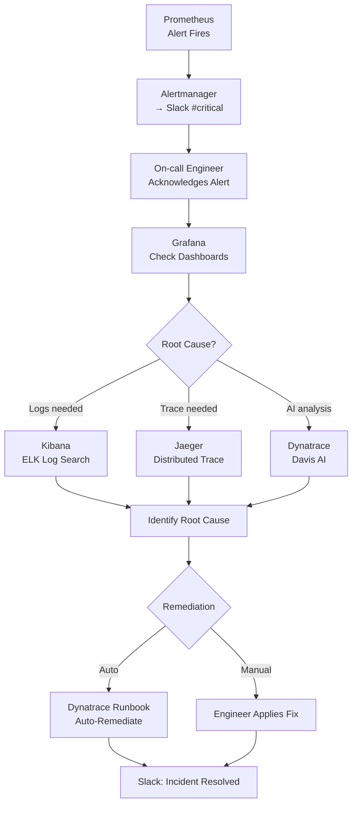

# Scenario 03: Incident Response
# Alert Fires → Grafana → ELK/Jaeger Debug → AIOps Auto-Remediation → ChatOps Notification

## Overview

This scenario shows the **complete incident response workflow**: from a Prometheus alert firing through debugging with ELK and Jaeger, AI-assisted root cause analysis with Dynatrace, and automated or manual remediation with Slack/Teams notifications at each step.

**Estimated Time:** 30–60 minutes to work through (practice regularly to reduce MTTR)



---

## Prerequisites

```bash
# Verify all monitoring tools are running
kubectl get pods -n monitoring | grep -E "prometheus|grafana|alertmanager"
kubectl get pods -n logging | grep -E "elasticsearch|kibana|filebeat"
kubectl get pods -n observability | grep jaeger
kubectl get pods -n dynatrace | grep dynakube
```

---

## Step 1: Simulate an Incident

```bash
# Simulate a CrashLoopBackOff pod
kubectl apply -f - <<'EOF'
apiVersion: apps/v1
kind: Deployment
metadata:
  name: broken-app
  namespace: default
  labels:
    app: broken-app
spec:
  replicas: 2
  selector:
    matchLabels:
      app: broken-app
  template:
    metadata:
      labels:
        app: broken-app
      annotations:
        prometheus.io/scrape: "true"
        prometheus.io/port: "8080"
    spec:
      containers:
      - name: app
        image: mycompany.jfrog.io/docker-local/myapp:broken
        resources:
          limits:
            memory: "64Mi"              # Very low — will OOMKill
        env:
        - name: CRASH_ON_START
          value: "true"
EOF

# Wait for pods to start crash-looping
kubectl get pods -w | grep broken-app
# Expected: broken-app-xxx  0/1  CrashLoopBackOff  3/5  2m
```

---

## Step 2: Prometheus Alert Fires

```yaml
# This alert rule should already be in your PrometheusRule (from monitoring setup)
# alert: PodCrashLoopBackOff
# Fires when pod has restarted > 5 times in 15 minutes
```

```bash
# Verify alert has fired
kubectl port-forward svc/prometheus-operated 9090:9090 -n monitoring &
# Open: http://localhost:9090/alerts
# Expected: PodCrashLoopBackOff FIRING for broken-app

# Check Alertmanager received the alert
kubectl port-forward svc/alertmanager-operated 9093:9093 -n monitoring &
# Open: http://localhost:9093
# Expected: 1 active alert in #alerts-critical group
```

**Slack receives:**
```
🔴 FIRING: PodCrashLoopBackOff
Alert: Pod default/broken-app is crash looping
Severity: critical
Namespace: default
Description: Pod has restarted 6 times in 15 minutes
Runbook: https://wiki.mycompany.com/runbooks/pod-crash-loop
```

---

## Step 3: Grafana — First Look

```bash
# Open Grafana
kubectl port-forward svc/grafana 3000:80 -n monitoring &
# Open: http://localhost:3000
```

**Dashboard: Kubernetes / Compute Resources / Namespace (Pods)**
```
1. Go to: Dashboards → Kubernetes / Compute Resources / Namespace (Pods)
2. Select namespace: default
3. Look for:
   - Pod "broken-app-xxx" showing:
     - CPU: Spiking then dropping (crash pattern)
     - Memory: Hitting limit (OOMKill signature)
     - Restarts: Step-function graph climbing
   - Other pods: Normal
4. Conclusion: Issue is isolated to "broken-app"
```

**Quick PromQL in Grafana Explore:**
```promql
# Pod restart count over last 30 mins
increase(kube_pod_container_status_restarts_total{namespace="default",pod=~"broken-app.*"}[30m])

# Memory usage vs limit
container_memory_usage_bytes{namespace="default",pod=~"broken-app.*"}
/ on(pod) kube_pod_container_resource_limits{resource="memory",namespace="default",pod=~"broken-app.*"}
```

---

## Step 4: ELK — Log Investigation

```bash
# Open Kibana
kubectl port-forward svc/kibana-kb-http 5601:5601 -n logging &
# Open: http://localhost:5601
```

**Kibana Discover — Step-by-Step:**
```
1. Go to: Discover (left sidebar)
2. Index pattern: filebeat-*
3. Time range: Last 1 hour
4. Add filter:
   - kubernetes.namespace.name: default
   - kubernetes.pod.name: broken-app*
5. Look at log entries — you should see repeated error like:
   java.lang.OutOfMemoryError: Java heap space
   OR
   Error: Cannot connect to database
   OR
   panic: runtime error: invalid memory address
```

**KQL search for the error:**
```
kubernetes.pod.name: broken-app* AND log.level: error
```

**Alternative: Search from kubectl**
```bash
# Get logs from the crashed container (previous run)
kubectl logs broken-app-xxx --previous --tail=50
# Expected: Shows last lines before crash

# Get logs from all pods with this label
kubectl logs -l app=broken-app --previous --tail=100
# If OOMKill:
# Expected: killed by signal 9 (SIGKILL)

# Describe pod for K8s events
kubectl describe pod broken-app-xxx
# Expected events:
# OOMKilled (exit code 137) — memory limit hit
# OR
# Error (exit code 1) — application error
```

---

## Step 5: Jaeger — Trace Investigation

```bash
# Open Jaeger UI
kubectl port-forward svc/jaeger-query 16686:16686 -n observability &
# Open: http://localhost:16686
```

**Jaeger trace analysis:**
```
1. Service: select "broken-app"
2. Operation: select "all"
3. Click "Find Traces"
4. Look for:
   - Traces with ERRORS (red markers)
   - Traces with very long duration (timeout)
5. Click on a failed trace:
   - Expand each span
   - Look for the first span with error=true
   - Check tags: http.status_code, error.message
   - Identify which downstream service failed
```

**Common findings:**
```
Span: broken-app → database-service
  Duration: 30s (timeout after 30s)
  Tags:
    error: true
    db.statement: "SELECT * FROM large_table"
    error.message: "connection timeout"
→ Root cause: Database connection pool exhausted
```

---

## Step 6: Dynatrace AI-Assisted Root Cause

```bash
# Dynatrace automatically creates a "Problem" card when it detects anomalies
# No manual trigger needed — Davis AI correlates all signals
```

**In Dynatrace Portal:**
```
1. Go to: Problems (bell icon in sidebar)
2. Find: Problem P-xxxxxxxx "Response time degradation"
3. Click on the problem:
   - Root cause analysis card shows:
     "Failure rate increase on broken-app triggered by
      memory saturation → GC pressure → high latency"
   - Affected services shown
   - Deployment marker (if Jenkins event was pushed)
4. Click "Suggested actions":
   - "Increase memory limit"
   - "Restart pod"
   - "Scale deployment"
```

**Auto-remediation runbook (if configured):**
```bash
# Dynatrace can trigger this automatically via webhook
# When: pod OOMKilled
# Action: increase memory limit and restart

kubectl patch deployment broken-app -n default \
  -p '{"spec":{"template":{"spec":{"containers":[{"name":"app","resources":{"limits":{"memory":"256Mi"}}}]}}}}'

kubectl rollout restart deployment/broken-app -n default
```

---

## Step 7: Apply Fix

### Fix A: Increase Memory Limit

```bash
# Fix: Increase memory limit
kubectl patch deployment broken-app -n default --type='json' \
  -p='[{"op": "replace", "path": "/spec/template/spec/containers/0/resources/limits/memory", "value": "512Mi"}]'

kubectl rollout status deployment/broken-app -n default
# Expected: deployment successfully rolled out
```

### Fix B: Fix Application Error

```bash
# Rebuild with fix and push to JFrog
docker build -t mycompany.jfrog.io/docker-local/myapp:fixed .
docker push mycompany.jfrog.io/docker-local/myapp:fixed

# Update deployment
kubectl set image deployment/broken-app \
  app=mycompany.jfrog.io/docker-local/myapp:fixed \
  -n default

kubectl rollout status deployment/broken-app -n default
```

### Fix C: Scale Out (if load-related)

```bash
kubectl scale deployment broken-app --replicas=5 -n default
kubectl get pods -l app=broken-app -n default
```

---

## Step 8: Verify Resolution

```bash
# Pods are healthy
kubectl get pods -l app=broken-app -n default
# Expected: All 2/2 Running, 0 restarts

# No more crash loops
kubectl get events -n default --sort-by='.lastTimestamp' | tail -20
# Expected: No more OOMKill or BackOff events

# Prometheus alert resolved
# Open: http://localhost:9090/alerts
# Expected: PodCrashLoopBackOff alert gone (or Resolved state)

# ELK logs show healthy
# Kibana Discover: filter by broken-app, last 15 mins
# Expected: No error level logs

# Jaeger: New traces should show 200 OK responses
```

---

## Step 9: Slack Incident Resolved Notification

```bash
# Send resolution notification manually (or via Alertmanager sendResolved: true)
curl -X POST -H 'Content-type: application/json' \
  --data '{
    "text": "✅ *RESOLVED: PodCrashLoopBackOff*\nPod: `default/broken-app`\nRoot cause: Memory limit too low (64Mi → 512Mi)\nResolved by: @devops-engineer\nMTTR: 12 minutes"
  }' \
  https://hooks.slack.com/services/<TEAM_ID>/<CHANNEL_ID>/<TOKEN>
```

**Alertmanager automatically sends resolved message when:**
- Alert stops firing (pods stable for 1m)
- Alertmanager receiver has `send_resolved: true`

---

## Incident Timeline Summary

| Time | Event | Tool | Action |
|------|-------|------|--------|
| T+0 | Pod crashes | Kubernetes | Pod enters CrashLoopBackOff |
| T+5m | Alert fires | Prometheus | PodCrashLoopBackOff rule triggers |
| T+5m | Slack notification | Alertmanager | #alerts-critical gets message |
| T+7m | Dashboard check | Grafana | Memory hitting limit identified |
| T+10m | Log investigation | Kibana | OOMKilled in logs confirmed |
| T+12m | Fix applied | kubectl | Memory limit increased to 512Mi |
| T+13m | Pods healthy | Kubernetes | All pods Running, 0 restarts |
| T+15m | Alert resolves | Prometheus | Alert clears automatically |
| T+15m | Slack resolved | Alertmanager | #alerts-critical gets ✅ message |

**MTTR: 15 minutes**

---

## Runbook: Common Incidents

### OOMKilled Pod

```bash
# Identify
kubectl describe pod <pod> | grep -A5 "Last State:"
# OOMKilled = exit code 137

# Fix
kubectl patch deployment <dep> -n <ns> \
  --type='json' \
  -p='[{"op":"replace","path":"/spec/template/spec/containers/0/resources/limits/memory","value":"512Mi"}]'
```

### CrashLoopBackOff (app error)

```bash
# Get crash logs
kubectl logs <pod> --previous

# Common causes:
# - Missing env var: check configmap/secret mounts
# - DB connection: check service name and credentials
# - Port conflict: check containerPort vs app config
```

### ImagePullBackOff

```bash
# Check error
kubectl describe pod <pod> | grep -A5 "Failed:"

# Fix: recreate pull secret
kubectl create secret docker-registry jfrog-pull-secret \
  --docker-server=mycompany.jfrog.io \
  --docker-username=robot-account \
  --docker-password=<token> \
  -n <namespace>
```

### High CPU causing throttling

```bash
# Identify throttled pods
kubectl top pods -n <namespace> --sort-by=cpu

# Check limits
kubectl get pod <pod> -o jsonpath='{.spec.containers[0].resources}'

# Fix: increase CPU limit or investigate infinite loop
kubectl patch deployment <dep> \
  --type='json' \
  -p='[{"op":"replace","path":"/spec/template/spec/containers/0/resources/limits/cpu","value":"2"}]'
```
