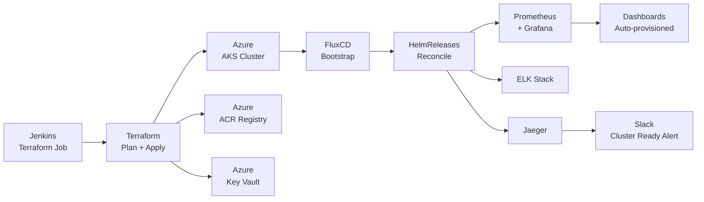

# Scenario 04: Infrastructure Provisioning
# Terraform Provisions AKS → FluxCD Bootstraps Cluster → Full Monitoring Stack Auto-Deployed

## Overview

This scenario shows **infrastructure-as-code driven environment creation**: Terraform provisions a complete Azure environment (AKS + ACR + Key Vault), FluxCD bootstraps on the new cluster, and the full monitoring stack (Prometheus + Grafana + ELK + Jaeger) is auto-deployed through GitOps.

**Estimated Time:** 45–60 minutes (most time is Azure provisioning)



---

## Step 1: Terraform Project Structure

```
infra/
├── main.tf              # Root module
├── variables.tf         # Input variables
├── outputs.tf           # Output values
├── provider.tf          # Azure provider config
├── terraform.tfvars     # Variable values (gitignored for secrets)
└── modules/
    ├── aks/             # AKS cluster module
    │   ├── main.tf
    │   ├── variables.tf
    │   └── outputs.tf
    ├── acr/             # Azure Container Registry module
    │   ├── main.tf
    │   ├── variables.tf
    │   └── outputs.tf
    └── keyvault/        # Key Vault module
        ├── main.tf
        ├── variables.tf
        └── outputs.tf
```

---

## Step 2: Terraform Configuration Files

### provider.tf

```hcl
# provider.tf
terraform {
  required_version = ">= 1.6.0"              # Minimum Terraform version

  required_providers {
    azurerm = {
      source  = "hashicorp/azurerm"
      version = "~> 3.80"                    # Azure provider version
    }
  }

  # Remote state in Azure Blob Storage
  backend "azurerm" {
    resource_group_name  = "rg-terraform-state"
    storage_account_name = "sttfstatedevops"
    container_name       = "tfstate"
    key                  = "prod/aks.tfstate"  # State file path
  }
}

provider "azurerm" {
  features {
    key_vault {
      purge_soft_delete_on_destroy = false   # Safety: keep deleted KV for 90 days
    }
  }
  # Credentials from environment variables:
  # ARM_CLIENT_ID, ARM_CLIENT_SECRET, ARM_SUBSCRIPTION_ID, ARM_TENANT_ID
}
```

### variables.tf

```hcl
# variables.tf
variable "resource_group_name" {
  description = "Name of the Azure Resource Group"
  type        = string
  default     = "rg-devops-prod"
}

variable "location" {
  description = "Azure region to deploy resources"
  type        = string
  default     = "eastus"
}

variable "environment" {
  description = "Environment tag (dev/staging/prod)"
  type        = string
  default     = "prod"
}

variable "aks_node_count" {
  description = "Number of AKS nodes"
  type        = number
  default     = 3
}

variable "aks_node_size" {
  description = "AKS node VM size"
  type        = string
  default     = "Standard_D4s_v3"
}

variable "kubernetes_version" {
  description = "Kubernetes version for AKS"
  type        = string
  default     = "1.28.0"
}
```

### main.tf

```hcl
# main.tf
# Creates the complete DevOps infrastructure

# Resource Group
resource "azurerm_resource_group" "main" {
  name     = var.resource_group_name
  location = var.location

  tags = {
    Environment = var.environment
    ManagedBy   = "Terraform"
    Team        = "DevOps"
  }
}

# Log Analytics Workspace (for AKS Container Insights)
resource "azurerm_log_analytics_workspace" "main" {
  name                = "law-devops-${var.environment}"
  location            = azurerm_resource_group.main.location
  resource_group_name = azurerm_resource_group.main.name
  sku                 = "PerGB2018"             # Pay-per-GB pricing
  retention_in_days   = 30                      # Log retention
}

# AKS Cluster
module "aks" {
  source = "./modules/aks"

  resource_group_name    = azurerm_resource_group.main.name
  location               = azurerm_resource_group.main.location
  cluster_name           = "aks-devops-${var.environment}"
  node_count             = var.aks_node_count
  node_size              = var.aks_node_size
  kubernetes_version     = var.kubernetes_version
  log_analytics_workspace_id = azurerm_log_analytics_workspace.main.id
  environment            = var.environment
}

# Azure Container Registry
module "acr" {
  source = "./modules/acr"

  resource_group_name = azurerm_resource_group.main.name
  location            = azurerm_resource_group.main.location
  acr_name            = "acrdevops${var.environment}"
  aks_principal_id    = module.aks.kubelet_identity_object_id  # Grant AKS pull access
}

# Key Vault
module "keyvault" {
  source = "./modules/keyvault"

  resource_group_name = azurerm_resource_group.main.name
  location            = azurerm_resource_group.main.location
  kv_name             = "kv-devops-${var.environment}"
  aks_principal_id    = module.aks.kubelet_identity_object_id
}
```

### modules/aks/main.tf

```hcl
# modules/aks/main.tf
resource "azurerm_kubernetes_cluster" "main" {
  name                = var.cluster_name
  location            = var.location
  resource_group_name = var.resource_group_name
  dns_prefix          = var.cluster_name
  kubernetes_version  = var.kubernetes_version

  # Default node pool
  default_node_pool {
    name                = "system"
    node_count          = var.node_count
    vm_size             = var.node_size
    type                = "VirtualMachineScaleSets"  # Required for autoscaler
    enable_auto_scaling = true
    min_count           = 2
    max_count           = 10
    os_disk_size_gb     = 100

    node_labels = {
      "nodepool" = "system"
    }
  }

  # Use managed identity (no service principal to rotate)
  identity {
    type = "SystemAssigned"
  }

  # Azure Monitor / Container Insights
  oms_agent {
    log_analytics_workspace_id = var.log_analytics_workspace_id
  }

  # Azure AD RBAC
  azure_active_directory_role_based_access_control {
    managed            = true
    azure_rbac_enabled = true
  }

  # Network plugin
  network_profile {
    network_plugin = "azure"             # Azure CNI (better performance)
    network_policy = "calico"            # Pod network policy
    load_balancer_sku = "standard"       # Required for multiple node pools
  }

  tags = {
    Environment = var.environment
    ManagedBy   = "Terraform"
  }
}

# Output kubelet identity for ACR/KV access
output "kubelet_identity_object_id" {
  value = azurerm_kubernetes_cluster.main.kubelet_identity[0].object_id
}

output "kube_config" {
  value     = azurerm_kubernetes_cluster.main.kube_config_raw
  sensitive = true
}
```

### outputs.tf

```hcl
# outputs.tf
output "aks_name" {
  description = "AKS cluster name"
  value       = module.aks.cluster_name
}

output "acr_login_server" {
  description = "ACR login server URL"
  value       = module.acr.login_server
}

output "key_vault_uri" {
  description = "Key Vault URI"
  value       = module.keyvault.vault_uri
}

output "resource_group_name" {
  description = "Resource group name"
  value       = azurerm_resource_group.main.name
}
```

---

## Step 3: Jenkins Pipeline for Terraform

```groovy
// Jenkinsfile.terraform — Infrastructure Pipeline
pipeline {
    agent any

    parameters {
        choice(name: 'ACTION', choices: ['plan', 'apply', 'destroy'], description: 'Terraform action')
        string(name: 'ENVIRONMENT', defaultValue: 'dev', description: 'Target environment')
    }

    environment {
        TF_VAR_environment = "${params.ENVIRONMENT}"
        TF_IN_AUTOMATION   = "true"
    }

    stages {
        stage('Terraform Init') {
            steps {
                withCredentials([azureServicePrincipal('azure-sp-credentials')]) {
                    sh """
                        export ARM_CLIENT_ID=${AZURE_CLIENT_ID}
                        export ARM_CLIENT_SECRET=${AZURE_CLIENT_SECRET}
                        export ARM_SUBSCRIPTION_ID=${AZURE_SUBSCRIPTION_ID}
                        export ARM_TENANT_ID=${AZURE_TENANT_ID}

                        cd infra/
                        terraform init -reconfigure
                    """
                }
            }
        }

        stage('Terraform Validate') {
            steps {
                sh 'cd infra/ && terraform validate'
            }
        }

        stage('Terraform Plan') {
            steps {
                withCredentials([azureServicePrincipal('azure-sp-credentials')]) {
                    sh """
                        export ARM_CLIENT_ID=${AZURE_CLIENT_ID}
                        export ARM_CLIENT_SECRET=${AZURE_CLIENT_SECRET}
                        export ARM_SUBSCRIPTION_ID=${AZURE_SUBSCRIPTION_ID}
                        export ARM_TENANT_ID=${AZURE_TENANT_ID}

                        cd infra/
                        terraform plan \
                          -var-file="terraform.tfvars" \
                          -out=tfplan
                    """
                }
                // Show plan summary
                sh 'cd infra/ && terraform show -no-color tfplan'
            }
        }

        stage('Approval') {
            when {
                expression { params.ACTION == 'apply' || params.ACTION == 'destroy' }
                expression { params.ENVIRONMENT == 'prod' }
            }
            steps {
                // Manual approval required for prod
                input message: "Apply Terraform changes to PROD?", ok: "Apply"
            }
        }

        stage('Terraform Apply / Destroy') {
            when {
                expression { params.ACTION != 'plan' }
            }
            steps {
                withCredentials([azureServicePrincipal('azure-sp-credentials')]) {
                    sh """
                        export ARM_CLIENT_ID=${AZURE_CLIENT_ID}
                        export ARM_CLIENT_SECRET=${AZURE_CLIENT_SECRET}
                        export ARM_SUBSCRIPTION_ID=${AZURE_SUBSCRIPTION_ID}
                        export ARM_TENANT_ID=${AZURE_TENANT_ID}

                        cd infra/
                        if [ "${params.ACTION}" = "apply" ]; then
                          terraform apply -auto-approve tfplan
                        else
                          terraform destroy -var-file="terraform.tfvars" -auto-approve
                        fi
                    """
                }
            }
        }

        stage('Configure kubectl') {
            when { expression { params.ACTION == 'apply' } }
            steps {
                withCredentials([azureServicePrincipal('azure-sp-credentials')]) {
                    sh """
                        az login --service-principal \
                          -u ${AZURE_CLIENT_ID} -p ${AZURE_CLIENT_SECRET} \
                          --tenant ${AZURE_TENANT_ID}

                        RG=\$(cd infra && terraform output -raw resource_group_name)
                        AKS=\$(cd infra && terraform output -raw aks_name)

                        az aks get-credentials \
                          --resource-group \$RG \
                          --name \$AKS \
                          --overwrite-existing

                        kubectl get nodes
                    """
                }
            }
        }

        stage('Bootstrap FluxCD') {
            when { expression { params.ACTION == 'apply' } }
            steps {
                withCredentials([string(credentialsId: 'github-pat', variable: 'GITHUB_TOKEN')]) {
                    sh """
                        flux bootstrap github \
                          --owner=myorg \
                          --repository=cluster-config \
                          --branch=main \
                          --path=clusters/${params.ENVIRONMENT} \
                          --personal \
                          --token-auth
                    """
                }
            }
        }
    }

    post {
        success {
            slackSend channel: '#infrastructure',
                color: 'good',
                message: "✅ Terraform ${params.ACTION} SUCCESS | Environment: ${params.ENVIRONMENT} | <${env.BUILD_URL}|View>"
        }
        failure {
            slackSend channel: '#infrastructure',
                color: 'danger',
                message: "❌ Terraform ${params.ACTION} FAILED | Environment: ${params.ENVIRONMENT} | <${env.BUILD_URL}|View Logs>"
        }
    }
}
```

---

## Step 4: FluxCD GitOps Repository Structure

```
cluster-config/
└── clusters/
    ├── dev/
    │   ├── flux-system/           # Auto-generated by flux bootstrap
    │   ├── namespaces.yaml        # Create monitoring, logging, etc. namespaces
    │   ├── monitoring/
    │   │   ├── kube-prometheus-stack.yaml   # HelmRelease for Prometheus+Grafana
    │   │   └── grafana-dashboards.yaml      # ConfigMap with dashboard JSON
    │   ├── logging/
    │   │   ├── eck-operator.yaml            # ECK (Elastic) operator
    │   │   ├── elasticsearch.yaml           # Elasticsearch cluster
    │   │   ├── kibana.yaml                  # Kibana
    │   │   └── filebeat.yaml               # Log collector DaemonSet
    │   └── tracing/
    │       └── jaeger.yaml                  # Jaeger all-in-one
    └── prod/
        └── (same structure)
```

### clusters/dev/namespaces.yaml

```yaml
# namespaces.yaml
# Creates all required namespaces
apiVersion: v1
kind: Namespace
metadata:
  name: monitoring
  labels:
    toolkit.fluxcd.io/tenant: monitoring
---
apiVersion: v1
kind: Namespace
metadata:
  name: logging
  labels:
    toolkit.fluxcd.io/tenant: logging
---
apiVersion: v1
kind: Namespace
metadata:
  name: observability
---
apiVersion: v1
kind: Namespace
metadata:
  name: prod
  labels:
    istio-injection: enabled
```

### clusters/dev/monitoring/kube-prometheus-stack.yaml

```yaml
# monitoring/kube-prometheus-stack.yaml
---
# HelmRepository: where to pull the chart from
apiVersion: source.toolkit.fluxcd.io/v1beta2
kind: HelmRepository
metadata:
  name: prometheus-community
  namespace: monitoring
spec:
  interval: 1h                         # Re-check for new chart versions
  url: https://prometheus-community.github.io/helm-charts
---
# HelmRelease: installs/upgrades the chart automatically
apiVersion: helm.toolkit.fluxcd.io/v2beta1
kind: HelmRelease
metadata:
  name: kube-prometheus-stack
  namespace: monitoring
spec:
  interval: 15m                        # Reconcile every 15 mins
  chart:
    spec:
      chart: kube-prometheus-stack
      version: "55.x"                  # Pin to major version, auto-patch
      sourceRef:
        kind: HelmRepository
        name: prometheus-community
        namespace: monitoring
  install:
    createNamespace: true
    remediation:
      retries: 3                        # Retry 3 times on install failure
  upgrade:
    remediation:
      retries: 3
  values:
    grafana:
      enabled: true
      adminPassword: "admin123"         # In production use: valuesFrom secretKeyRef
      persistence:
        enabled: true
        size: 5Gi
      dashboardProviders:
        dashboardproviders.yaml:
          apiVersion: 1
          providers:
          - name: default
            folder: ''
            type: file
            disableDeletion: false
            editable: true
            options:
              path: /var/lib/grafana/dashboards/default
      dashboards:
        default:
          kubernetes-cluster:
            gnetId: 7249
            revision: 1
            datasource: Prometheus
          node-exporter:
            gnetId: 1860
            revision: 29
            datasource: Prometheus
    prometheus:
      prometheusSpec:
        retention: 30d
        storageSpec:
          volumeClaimTemplate:
            spec:
              accessModes: ["ReadWriteOnce"]
              resources:
                requests:
                  storage: 50Gi
    alertmanager:
      alertmanagerSpec:
        storage:
          volumeClaimTemplate:
            spec:
              accessModes: ["ReadWriteOnce"]
              resources:
                requests:
                  storage: 5Gi
```

### clusters/dev/tracing/jaeger.yaml

```yaml
# tracing/jaeger.yaml
---
apiVersion: source.toolkit.fluxcd.io/v1beta2
kind: HelmRepository
metadata:
  name: jaegertracing
  namespace: observability
spec:
  interval: 1h
  url: https://jaegertracing.github.io/helm-charts
---
apiVersion: helm.toolkit.fluxcd.io/v2beta1
kind: HelmRelease
metadata:
  name: jaeger
  namespace: observability
spec:
  interval: 15m
  chart:
    spec:
      chart: jaeger
      version: "0.x"
      sourceRef:
        kind: HelmRepository
        name: jaegertracing
        namespace: observability
  values:
    allInOne:
      enabled: true                    # Single pod for dev; use production config for prod
    storage:
      type: none                       # In-memory for dev; use elasticsearch for prod
    query:
      enabled: true
    collector:
      enabled: true
    agent:
      enabled: false                   # Use sidecar injection instead
```

---

## Step 5: Bootstrap FluxCD

```bash
# Step 1: Export GitHub token
export GITHUB_TOKEN=ghp_your_personal_access_token

# Step 2: Bootstrap Flux on the new AKS cluster
flux bootstrap github \
  --owner=myorg \
  --repository=cluster-config \
  --branch=main \
  --path=clusters/dev \
  --personal \
  --token-auth

# Expected output:
# ✔ Generating manifests
# ✔ Staging manifests
# ✔ Reconciling manifests
# ✔ Source secret "flux-system/flux-system" created
# ✔ Repository "https://github.com/myorg/cluster-config" created
# ✔ Components deployed successfully

# Step 3: Watch Flux reconcile the cluster
kubectl get kustomizations -n flux-system --watch
# Expected: monitoring, logging, tracing all become Ready=True

# Step 4: Verify HelmReleases are deployed
kubectl get helmreleases -A
# Expected:
# monitoring    kube-prometheus-stack    True    55.x
# observability jaeger                   True    0.x
```

---

## Step 6: Verify Full Stack

```bash
# Check all pods are running
kubectl get pods -n monitoring
# Expected: prometheus-xxx, grafana-xxx, alertmanager-xxx all Running

kubectl get pods -n logging
# Expected: elasticsearch-xxx, kibana-xxx, filebeat-xxx all Running

kubectl get pods -n observability
# Expected: jaeger-xxx Running

# Access Grafana
kubectl port-forward svc/kube-prometheus-stack-grafana 3000:80 -n monitoring &
# Open: http://localhost:3000 (admin / admin123)
# Dashboards should already be imported via Flux HelmRelease values

# Access Kibana
kubectl port-forward svc/kibana-kb-http 5601:5601 -n logging &
# Open: http://localhost:5601

# Access Jaeger
kubectl port-forward svc/jaeger-query 16686:16686 -n observability &
# Open: http://localhost:16686

# Send Slack notification that cluster is ready
curl -X POST -H 'Content-type: application/json' \
  --data '{
    "text": "🎉 *New Cluster Ready!*\nEnvironment: dev\nAKS: aks-devops-dev\nMonitoring: Prometheus + Grafana ✅\nLogging: ELK Stack ✅\nTracing: Jaeger ✅"
  }' \
  https://hooks.slack.com/services/<TEAM_ID>/<CHANNEL_ID>/<TOKEN>
```

---

## Verification Checklist

```bash
# Infrastructure
az aks show -g rg-devops-dev -n aks-devops-dev --query provisioningState
# Expected: Succeeded

az acr show -n acrdevopsdev --query provisioningState
# Expected: Succeeded

# K8s Cluster
kubectl get nodes
# Expected: 3 nodes Ready

kubectl get namespaces
# Expected: monitoring, logging, observability, prod, flux-system all exist

# Flux
flux get all -A
# Expected: All sources and kustomizations Ready=True, HelmReleases Ready=True

# Monitoring
kubectl get pods -n monitoring --field-selector=status.phase!=Running
# Expected: empty (all Running)

# Verify Prometheus is scraping K8s
kubectl port-forward svc/prometheus-operated 9090:9090 -n monitoring &
curl -s http://localhost:9090/api/v1/targets | jq '.data.activeTargets | length'
# Expected: 30+ targets
```

---

## Rollback Procedures

```bash
# Rollback Terraform (destroy new infra)
cd infra/
terraform destroy -var-file="terraform.tfvars" -auto-approve

# Rollback FluxCD HelmRelease to previous version
flux suspend helmrelease kube-prometheus-stack -n monitoring
kubectl get helmrelease kube-prometheus-stack -n monitoring -o yaml | grep lastAttemptedRevision
# Then update chart version in Git to the previous version

# Rollback entire cluster state via Git
git revert <commit-that-changed-values>
git push origin main
# Flux will automatically reconcile back to the reverted state
```

---

## Time Estimates

| Step | Description | Time |
|------|-------------|------|
| 1 | Run `terraform apply` | ~15 mins (Azure AKS provisioning) |
| 2 | Configure kubectl + validate | ~2 mins |
| 3 | `flux bootstrap` | ~3 mins |
| 4 | Flux reconciles monitoring stack | ~5 mins |
| 5 | Flux reconciles ELK stack | ~8 mins |
| 6 | Flux reconciles Jaeger | ~2 mins |
| 7 | Verify all dashboards work | ~5 mins |
| **Total** | **Full environment ready** | **~40 mins** |

---

## Troubleshooting

| Issue | Fix |
|-------|-----|
| AKS provisioning fails | Check Azure quota limits: `az vm list-usage -l eastus -o table` |
| Flux bootstrap fails | Verify GitHub PAT has `repo` scope; check network access to GitHub |
| HelmRelease stuck in pending | `kubectl describe helmrelease <name> -n <ns>` for error; check HelmRepository URL |
| Prometheus not scraping | Verify ServiceMonitor labels match Prometheus selector |
| ELK pods OOMKilled | Increase `resources.limits.memory` in HelmRelease values |
| Grafana dashboards missing | Check ConfigMap exists; verify `dashboardProviders` path matches `dashboards` mount |
| Terraform state lock | `terraform force-unlock <LOCK_ID>` if pipeline crashed mid-apply |
| AKS node NotReady | Check NSG rules; verify node VM size supports requested resources |
